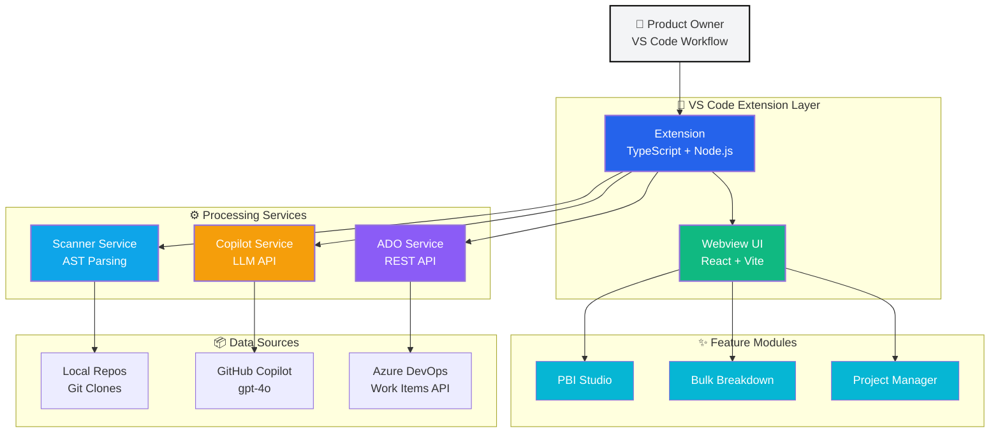
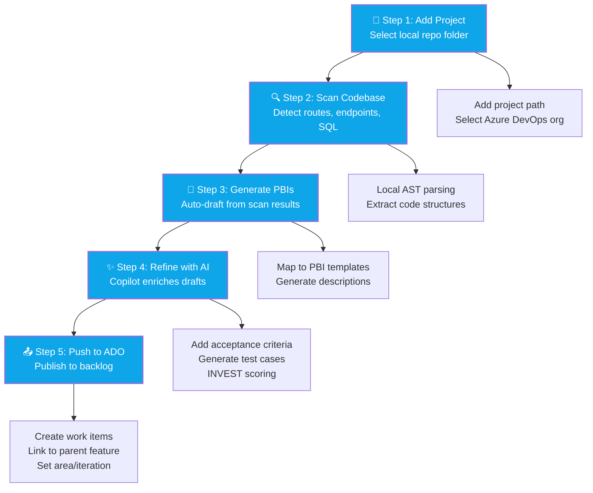
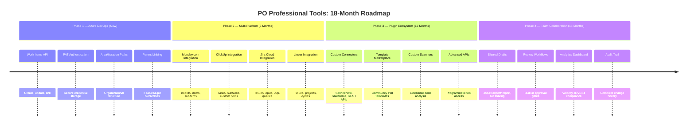
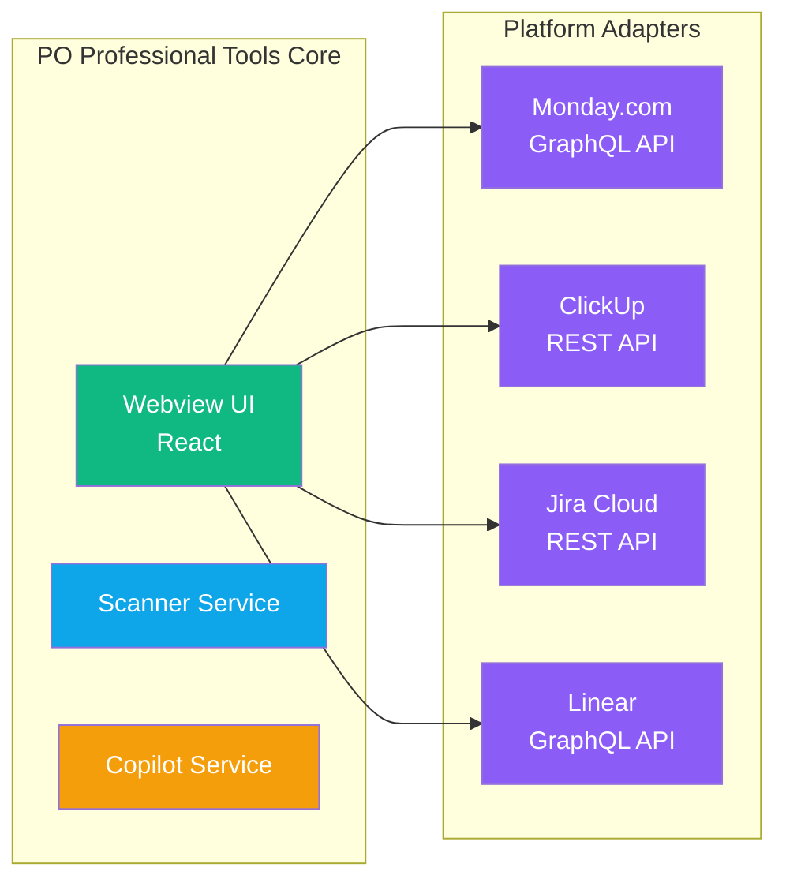
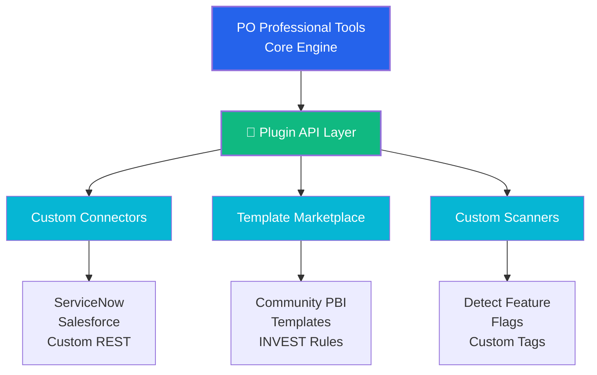
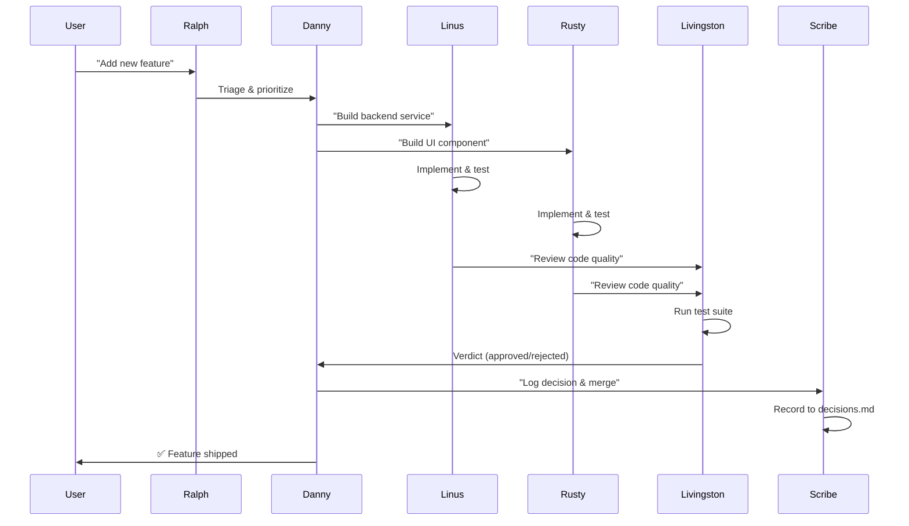

# PO Professional Tools: Sales Pitch

## Executive Summary

Product Owners spend 40–60% of their week drafting PBIs manually, losing context between code and backlog, and fighting inconsistency across teams. **PO Professional Tools** is a local-first VS Code extension that slashes PBI drafting time by 60%+, bridges the gap between codebase and backlog through intelligent scanning, and delivers AI-assisted refinement with zero SaaS dependency. Built for Azure DevOps today, designed as a platform for tomorrow.

---

## Problem Statement

### The PO Pain Points

**Manual PBI Drafting is Slow**  
POs spend hours each week writing user stories, acceptance criteria, and test cases from scratch. Copy-paste from old PBIs leads to drift; starting from blank templates is time-consuming and error-prone.

**Context Loss Between Code and Backlog**  
Engineering teams work in code; POs work in Azure DevOps. Routes, API endpoints, and database objects exist in the codebase, but POs manually discover them through Slack threads, Confluence docs, or guesswork. Critical details get lost in translation.

**Inconsistency Across Teams**  
Every PO has their own style. Some write detailed acceptance criteria; others write one-liners. INVEST principles are taught in training but rarely enforced at scale. Quality varies wildly across the backlog.

**Tool Lock-In and SaaS Overhead**  
Most PO tools require cloud subscriptions, data export, and vendor lock-in. Orgs behind firewalls or with compliance requirements can't adopt SaaS-first tools. Local-first solutions are rare.

---

## Solution Overview

**PO Professional Tools** is a VS Code extension that runs entirely on the PO's machine, integrating with their existing workflow (GitHub Copilot, Azure DevOps, local repos). It delivers:

- **AI-Assisted PBI Generation** — Copilot-powered drafting of user stories, bugs, and features with structured acceptance criteria and test cases
- **Code-Aware Context** — Scan local repos for routes, API endpoints, SQL objects; inject findings directly into PBI drafts
- **Bulk Breakdown** — Transform a large feature into 10+ prefixed child items in seconds (e.g., "PAL Guest Payment - Login", "PAL Guest Payment - API")
- **Azure DevOps Integration** — Push PBIs, test cases, and bugs directly to ADO with correct work item types, parent linking, and area/iteration paths
- **Local-First Architecture** — No SaaS, no data export, no vendor lock-in. Runs in VS Code with GitHub Copilot (already paid for by most enterprise orgs).

---

## Key Features

### 1. PBI Studio
Create or edit PBIs (user stories, bugs, features) with AI refinement. Upload screenshots, apply INVEST scoring, generate professional-quality acceptance criteria, and push to ADO in one click.

**Why it matters:** Reduces PBI drafting time from 20 minutes to 5 minutes per item. Enforces consistency and quality at scale.

### 2. Bulk Breakdown
Break a large feature into many prefixed child items. Choose prefixes (e.g., "PAL Guest Payment"), define suffixes manually or with AI, and optionally create a parent Feature/Epic to link them all.

**Why it matters:** Enables SAFe/LeSS-style decomposition without the manual grind. One feature → 15 child PBIs in 90 seconds.

### 3. Code Scanning
Scan multi-project repos to detect routes, API endpoints, SQL stored procedures, and other structural elements. Inject findings into PBI drafts for context-aware backlog management.

**Why it matters:** Bridges the gap between engineering and product. POs reference real endpoints instead of guessing. Engineering gets PBIs that match the codebase.

### 4. Azure DevOps Integration
Push backlog items to ADO with correct work item types (PBI, User Story, Bug, Task, Feature, Epic). Supports area paths, iteration paths, parent linking, and attachments. PAT stored securely in VS Code Secret Storage.

**Why it matters:** No context switching. POs draft in VS Code, push to ADO, and move on. One tool, one workflow.

### 5. Extensibility (Platform Play)
Built on a modular architecture. Azure DevOps is the first integration; Monday.com, ClickUp, Jira, and Linear are next. Custom plugins for org-specific workflows (e.g., HIPAA compliance fields, DoD classification).

**Why it matters:** This is not a one-off tool. It's a platform for PO productivity. Orgs can build custom connectors and extensions without rebuilding the core.

---

## Architecture



**Key Design Principles:**
- **Local-first:** All data stays on the user's machine until explicitly pushed to ADO
- **Composable:** Scanner, Copilot, ADO services are independent; swap out ADO for Jira without touching the scanner
- **Extensible:** Webview UI is built with React; new features are UI components + message types
- **Zero SaaS:** Runs on VS Code + GitHub Copilot (already enterprise-licensed); no new subscriptions

---

## User Journey

### Step-by-Step Workflow



### Traditional vs. PO Professional Tools

```mermaid
graph TB
    subgraph Traditional["❌ Manual PBI Drafting (20–30 mins)"]
        T1["1. Open ADO"] --> T2["2. Search for examples"]
        T2 --> T3["3. Copy-paste template"]
        T3 --> T4["4. Fill in details manually"]
        T4 --> T5["5. Write acceptance criteria"]
        T5 --> T6["6. Create test cases"]
        T6 --> T7["7. Publish & hope for clarity"]
    end
    
    subgraph Smart["✅ PO Professional Tools (5–7 mins)"]
        S1["1. Open VS Code"] --> S2["2. Add project"]
        S2 --> S3["3. Scan codebase"]
        S3 --> S4["4. Copilot auto-generates<br/>full PBI + tests"]
        S4 --> S5["5. Click 'Push to ADO'"]
    end
    
    style T1 fill:#ef4444,color:#fff
    style T2 fill:#ef4444,color:#fff
    style T3 fill:#ef4444,color:#fff
    style T4 fill:#ef4444,color:#fff
    style T5 fill:#ef4444,color:#fff
    style T6 fill:#ef4444,color:#fff
    style T7 fill:#ef4444,color:#fff
    
    style S1 fill:#22c55e,color:#fff
    style S2 fill:#22c55e,color:#fff
    style S3 fill:#22c55e,color:#fff
    style S4 fill:#22c55e,color:#fff
    style S5 fill:#22c55e,color:#fff
```



### Detailed Walkthrough

**Step 1: Add a Project**  
Open **Projects** tab → **Add Project** → select local cloned repo folder.

**Step 2: Scan the Codebase**  
Click **Scan** to detect routes, API endpoints, SQL objects. Scanner runs locally; results stored in extension state.

**Step 3: Generate PBIs**  
Click **Generate PBIs** to auto-draft backlog items from scan results. Each route/endpoint becomes a PBI draft with pre-filled description and context.

**Step 4: Refine with AI**  
Open **PBI Studio** → select a draft → click **Generate full story in-panel**. GitHub Copilot enriches the draft with:
- Professional title
- Structured acceptance criteria (4–7 testable conditions)
- Test cases
- INVEST scoring guidance

**Step 5: Push to ADO**  
Review the draft → click **Push to ADO**. Item appears in Azure DevOps with correct work item type, area path, iteration, and parent linking.

**Total time:** 5–7 minutes from scan to published PBI. Traditional flow: 20–30 minutes.

---

## Extensibility Roadmap

### Product Evolution Timeline



### Detailed Phase Breakdown

#### **Phase 1: Azure DevOps (Shipped)**
- ✅ Work Items API (create, update, link)
- ✅ PAT authentication
- ✅ Area/iteration path support
- ✅ Parent linking (Feature/Epic)

**Outcome:** Core tool is production-ready for Azure DevOps shops.

---

#### **Phase 2: Multi-Platform Integrations (Next 6 Months)**



- **Monday.com** — Boards, items, subitems, custom fields
- **ClickUp** — Tasks, subtasks, custom statuses
- **Jira Cloud** — Issues, epics, sprints, JQL queries
- **Linear** — Issues, projects, cycles

**Why:** Teams don't stick with one tool. Once adoption happens in Azure DevOps, demand shifts to "can you do this for Monday?" and "what about ClickUp?" Multi-platform support is the key to network effects.

---

#### **Phase 3: Plugin Ecosystem (12 Months)**



- **Custom Connectors** — Org-specific integrations (ServiceNow, Salesforce, custom REST APIs)
- **Template Marketplace** — Community-contributed PBI templates, acceptance criteria patterns, INVEST scoring rules
- **Custom Scanners** — Extend scanner to detect custom annotations, trace IDs, feature flags

**Why:** Enterprises have custom workflows. A plugin SDK lets them build connectors without touching the core. This creates a marketplace and recurring revenue model.

---

#### **Phase 4: Team Collaboration (18 Months)**

- **Shared Drafts** — Export/import PBI drafts as JSON; share via Git or network drives
- **Review Workflows** — Built-in approval flows for PBI quality gates
- **Analytics Dashboard** — Track PBI velocity, INVEST compliance, cycle time from draft to done

**Why:** POs don't work alone. Shared review workflows and analytics enable distributed teams to collaborate and measure impact.

---

### Why This Roadmap Matters

**Azure DevOps is the wedge.** Once POs adopt the tool, they'll demand integrations for Monday.com, ClickUp, and their custom internal systems. This becomes a **platform**, not a point solution.

```mermaid
graph LR
    A["Phase 1<br/>Azure Wedge"] --> B["Phase 2<br/>Multi-Platform"]
    B --> C["Phase 3<br/>Plugin Ecosystem"]
    C --> D["Phase 4<br/>Platform Network"]
    
    D -->|Revenue| E["Marketplace Sales<br/>Premium Support<br/>Custom Dev"]
    
    style A fill:#2563eb,color:#fff
    style B fill:#0ea5e9,color:#fff
    style C fill:#10b981,color:#fff
    style D fill:#8b5cf6,color:#fff
    style E fill:#f59e0b,color:#fff,stroke-width:2px

---

## Business Case

### Time Savings

| Activity | Manual (mins) | With Tool (mins) | Savings |
|----------|---------------|------------------|---------|
| Draft 1 user story | 20 | 5 | **75%** |
| Break 1 feature into 15 PBIs | 60 | 2 | **97%** |
| Scan codebase for context | 30 | 1 | **97%** |
| Push 10 PBIs to ADO | 20 | 2 | **90%** |

**Per PO per week:** 8–12 hours saved (assuming 20 PBIs drafted, 2 features broken down, 3 scans).

**Per team (3 POs):** 24–36 hours/week = **$50k–75k/year in reclaimed capacity** (at $100/hr blended rate).

### Quality Improvements

- **Consistency:** AI-generated acceptance criteria follow INVEST principles by default
- **Traceability:** Code scanning links PBIs to actual routes/endpoints; reduces engineering confusion
- **Testability:** Auto-generated test cases improve QA handoff quality

### Adoption Drivers

- **No SaaS friction:** Runs locally; no procurement delays, no data export concerns
- **Leverages existing tools:** GitHub Copilot (already licensed), VS Code (already adopted), Azure DevOps (already paid for)
- **Low training cost:** VS Code UI is familiar; PBI Studio is intuitive; AI does the heavy lifting

---

## 🤖 Meet the AI Team

This project is built with **Squad** — an AI team coordination system that enables multiple specialized agents to collaborate autonomously. Our core team:

```
┌────────────────────────────────────────────────────────────────┐
│                      🏗️  DANNY — Lead                          │
│                  Strategic Decision Maker                       │
├────────────────────────────────────────────────────────────────┤
│ • Owns product architecture and roadmap alignment              │
│ • Reviews major features for quality and scope coherence       │
│ • Makes technical trade-off decisions                          │
│ • Mentors other agents on strategic direction                  │
└────────────────────────────────────────────────────────────────┘

┌────────────────────────────────────────────────────────────────┐
│               ⚛️  RUSTY — Frontend Developer                    │
│                    UI/UX Implementation                         │
├────────────────────────────────────────────────────────────────┤
│ • Builds React components in the VS Code Webview               │
│ • Handles UI state management and responsiveness               │
│ • Owns PBI Studio, Bulk Breakdown, and Project interfaces      │
│ • Ensures consistent design patterns and accessibility         │
└────────────────────────────────────────────────────────────────┘

┌────────────────────────────────────────────────────────────────┐
│               🔧  LINUS — Backend Developer                    │
│                  Services & Integrations                        │
├────────────────────────────────────────────────────────────────┤
│ • Implements Scanner, Copilot, and ADO integration services    │
│ • Manages VS Code Extension API interactions                   │
│ • Handles authentication (PAT), API calls, and data flow        │
│ • Plans multi-platform integrations (Monday, ClickUp, Jira)    │
└────────────────────────────────────────────────────────────────┘

┌────────────────────────────────────────────────────────────────┐
│              🧪  LIVINGSTON — Quality Engineer                 │
│                  Testing & Edge Case Coverage                  │
├────────────────────────────────────────────────────────────────┤
│ • Designs and implements unit and integration tests            │
│ • Validates edge cases and error handling paths                │
│ • Ensures PBI generation quality and accuracy                  │
│ • Owns test coverage and CI/CD pipeline health                 │
└────────────────────────────────────────────────────────────────┘

┌────────────────────────────────────────────────────────────────┐
│              📋  SCRIBE — Session Logger                        │
│              Memory, Decisions, and Logs                        │
├────────────────────────────────────────────────────────────────┤
│ • Records all decisions made during development                │
│ • Maintains team memory (.squad/decisions.md)                  │
│ • Logs session activity for transparency and auditing          │
│ • Bridges knowledge across team members and sessions           │
└────────────────────────────────────────────────────────────────┘

┌────────────────────────────────────────────────────────────────┐
│              🔄  RALPH — Work Monitor                           │
│                  Queue Management & Continuity                 │
├────────────────────────────────────────────────────────────────┤
│ • Monitors GitHub issues and pull requests                     │
│ • Triages incoming work and routes to appropriate agents       │
│ • Ensures the team never sits idle; keeps pipeline flowing     │
│ • Manages backlog prioritization and work-in-progress          │
└────────────────────────────────────────────────────────────────┘
```

### How the Team Works Together



### Why This Matters for Contributors

**You're not alone.** When you join the team:

- 🤝 **Collaboration** — Work alongside specialized agents who handle their domains expertly
- 📚 **Shared Memory** — All decisions, code patterns, and learnings are captured in `.squad/decisions.md`
- 🔍 **Quality Gates** — Livingston ensures nothing ships with bugs; Danny ensures nothing deviates from vision
- 📊 **Visibility** — Ralph keeps the backlog visible and prioritized; you always know what's next
- ⚡ **Continuity** — Scribe maintains institutional memory across sessions; you're never starting from scratch

### Want to Contribute?

The Squad system makes it easy for new team members to jump in:

1. **Clone the repo** and review `.squad/team.md` to meet the team
2. **Read `.squad/decisions.md`** to understand what's been decided and why
3. **Pick an issue** or propose a feature — Ralph will route it to the right agent
4. **Work in parallel** — Your work doesn't block others; we use git worktrees and parallel branches
5. **Get feedback early** — Reviews from Danny and Livingston before merge

---

### Why Join Now?

**1. Solve a Real Problem**  
Every Product Owner fights this pain. You have the opportunity to ship a tool that reclaims 60% of a PO's week and makes backlog management feel effortless.

**2. Shape the Product**  
This is the founding moment. Your input defines the roadmap. Want Monday.com integration? Custom templates? Advanced analytics? You decide.

**3. Own the Platform Play**  
Azure DevOps is the wedge. The next phase is multi-platform integrations and a plugin ecosystem. Early contributors become domain experts in a space with zero competition.

**4. Local-First Wins**  
SaaS tools lose to compliance, firewalls, and data sovereignty concerns. Local-first tools win in enterprise. This architecture is defensible.

### What We're Building

- **Months 1–3:** Stabilize Azure DevOps integration, add screenshot attachments, refine Copilot prompts
- **Months 4–6:** Ship Monday.com and ClickUp integrations; launch template marketplace
- **Months 7–12:** Plugin SDK, custom scanner API, team collaboration features

### How to Get Involved

1. **Clone the repo:** `git clone <repo-url>`
2. **Run locally:** Follow README setup (5 minutes)
3. **Test the workflow:** Add a project → scan → generate → push to ADO
4. **Join the team:** Contribute code, templates, or integrations. We're looking for TypeScript devs, UX designers, and POs who want to dogfood the tool.

---

## Appendix: Technical Stack

- **Extension:** TypeScript, VS Code Extension API, Node.js
- **Webview UI:** React 18, Vite, CSS Modules
- **Build:** esbuild (extension), Vite (webview)
- **AI:** VS Code Language Model API (GitHub Copilot gpt-4o with three-pass fallback)
- **Integrations:** Azure DevOps REST API (OAuth + PAT), planned: Monday.com GraphQL, ClickUp REST, Jira Cloud
- **Storage:** VS Code Secret Storage (PAT), extension state (drafts, scans, settings)

---

**Questions?** Open an issue or reach out directly. Let's build the tool POs have been waiting for.
