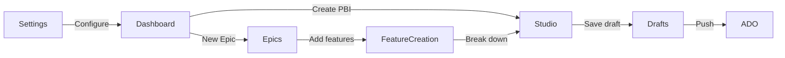

# PO-Professional-Tools — UI/UX Design Refresh

**Authors:** Tess (UX Designer), Saul (UI Designer)  
**Status:** Living Document  
**Last Updated:** 2026-07-08  
**Purpose:** Guide the UI/UX refresh to make the extension feel warm, delightful, and energizing while maintaining accessibility and VS Code consistency. Sections 6–8: UX/a11y (Tess). Section 9: visual tokens & david-ai bridge (Saul). Section 10: responsive layout & text hierarchy (Tess). Section 11: modern UI + contrast token standards (Saul). Section 13: information architecture & flow logic (Tess). Section 14: Phase 3 conversational UX (Tess).

---

## Section 1: Problem Statement

### The Current State: "Sad and Unhappy"

The extension currently works functionally, but the user experience feels **cold, clinical, and lacking delight**. Users describe the interface as "sad" — it gets the job done but doesn't inspire or energize. Specifically:

**Pain Points:**

1. **Dark, Cold Color Palette**
   - Heavy reliance on neutral grays and clinical blues
   - No warmth or vibrancy in the accent colors
   - AI-powered features (the "magic" of the extension) don't visually stand out as special

2. **Limited Micro-Interactions**
   - Buttons and cards are static — no hover elevation, no subtle animations
   - State changes are abrupt (instant transitions)
   - No feedback that makes interactions feel responsive and alive

3. **Barebones Empty States**
   - Blank areas with no guidance or encouragement
   - PBI Studio starts with empty form fields — uninviting
   - Missing opportunities to motivate and guide users

4. **AI Operations Feel Mechanical**
   - AI generation shows generic spinners with no personality
   - Success states are silent (no celebration or positive reinforcement)
   - Loading states don't convey "AI magic" — they feel like any other loading operation

5. **No Celebratory Moments**
   - Completing tasks (creating PBIs, pushing to ADO) has no visual reward
   - Missing opportunities to build positive emotional connection
   - Users don't feel accomplished after using the tool

**The Goal:**

Transform the extension from **functional but cold** → **functional AND delightful**. Users should feel energized when they open the dashboard, excited to generate PBIs with AI, and satisfied when they complete tasks. The UI should convey warmth, intelligence, and approachability.

---

## Section 2: AI-UX Pattern Opportunities

Applying the 5 AI-UX design patterns to specific features in PO-Professional-Tools:

### 1. Predictive UX → Smart Defaults & Suggestions

**Opportunity:** PBI title/type suggestions as user types

**Current State:** User must manually fill all fields from scratch.

**Enhanced Experience:**
- **Smart Title Suggestions:** As user types description in PBI Studio, show 2-3 suggested titles as clickable pills below the input
  - Visual: Light gray pills with violet accent on hover, small sparkle icon ✨
  - Behavior: Click to apply, or ignore and keep typing
  - Implementation: Debounced `onChange` → quick LM API call → render suggestions

- **Work Item Type Prediction:** When description has keywords like "bug", "fix", "error" → auto-select "Bug" type with hint: "Predicted: Bug (High confidence)"
  - Visual: Subtle badge next to dropdown showing prediction
  - Behavior: User can override with one click

- **Smart Defaults from Workspace:** Pre-fill project context from `package.json`, README
  - Example: If README mentions "authentication", suggest "Authentication" as area/tag

**Design Principle:** Predictions are **non-intrusive helpers**, not mandatory steps. Always ignorable.

---

### 2. Generative Assistance → AI PBI Generation Flows

**Opportunity:** Make AI generation feel like "magic moments" with better visual feedback

**Current State:** AI generation is functional but feels clinical (spinner → result).

**Enhanced Experience:**

**A. The Hero "Create" Area (Dashboard + PBI Studio)**
- **Current:** Generic "Create PBI" button
- **Redesign:** Large, inviting call-to-action with gradient background
  - Copy: "What will you build today? ✨" (warm, energizing)
  - Button: "Generate with AI" with violet gradient (`#7c3aed → #6d28d9`) + shimmer animation on hover
  - Hover effect: Button lifts slightly (`translateY(-2px)`) with subtle shadow increase
  - Feels like unlocking superpowers, not just clicking a button

**B. AI Loading States (Creation Mode)**
- **Current:** Basic spinner with "Loading..."
- **Redesign:** Animated gradient shimmer (purple-to-teal wave moving across a placeholder card)
  - Copy: "✨ AI is analyzing your code… This may take a few seconds."
  - Visual: Skeleton screen with animated gradient overlay (not just spinner)
  - Personality: Encouraging, patient, warm

**C. AI Success State (Creation Complete)**
- **Current:** Result appears instantly with no fanfare
- **Redesign:** Brief success animation before settling
  1. Green flash (0.3s) across the entire PBI card
  2. Checkmark animation (scales in with slight bounce)
  3. Badge: "✨ AI-generated" with violet accent
  4. Optional: Subtle confetti particles (1 second, then disappear)
  - Audio (optional, user setting): Soft "ding" on success

**D. Co-Creation Mode ("Refine with AI")**
- **Current:** Text area with "Refine" button → result replaces fields
- **Redesign:** Chat-like conversational interface
  - User prompt appears as a bubble (right-aligned, teal background)
  - AI response as bubble (left-aligned, violet background)
  - Show before/after comparison: split view or highlighted diffs (green = added, yellow = changed)
  - History: User can scroll up to see previous refinement prompts
  - Feels collaborative, not transactional

**Design Principle:** AI creation is a **delightful experience**, not just a function. Visuals, copy, and animations convey intelligence and care.

#### 2.2.1 AI Loading & Success Copy (Phase 2 — Implementation Spec)

**Owner:** Tess · **Implement:** Rusty (`LoadingBar` / `AiLoadingBar`, `App.tsx` toast stack)  
**Branch:** `feature/a11y-david-ui-refresh`

Warm, encouraging copy replaces clinical "Loading…" / silent success. Pair every visual state with screen-reader text (§6.6).

**AI loading labels** — use `variant="ai"` on `LoadingBar` or `<AiLoadingBar />`; override `label` only when context needs specificity.

| Context | Default label | `ariaLabel` (no emoji) |
|---------|---------------|------------------------|
| Generic AI work | ✨ AI is thinking… | AI is processing your request |
| PBI generation | ✨ AI is drafting your PBI… | AI is generating a product backlog item |
| Story / feature breakdown | ✨ AI is breaking this down… | AI is generating child work items |
| Refine with AI | ✨ AI is refining your draft… | AI is refining the draft |
| Code scan | ✨ AI is reading your code… | AI is analyzing project context |

**Visual:** `.ai-shimmer` on the indeterminate bar fill (violet soft wave), not the teal ADO `progress-fill`.

**Success toast copy** — celebratory but brief; always include a next step when relevant. Apply `.success-pop` animation on `level-success` toasts.

| Event | Toast copy |
|-------|------------|
| PBI generated | Nailed it! PBI ready to edit. |
| Stories generated | Nice work! {n} stories ready for review. |
| Feature draft created | Nailed it! Feature draft ready to edit. |
| Pushed to ADO | Great job! Pushed to Azure DevOps. |
| Refinement complete | Looking good! Draft updated. |

**`aria-live` for AI states** (extends §6.6):

| State | `aria-live` | `role` | Rationale |
|-------|-------------|--------|-----------|
| AI loading / progress | `polite` | `status` | Non-urgent wait; do not interrupt current reading |
| AI success | `polite` | `status` | Positive confirmation; toast stack is already polite |
| AI error | `assertive` | `alert` | User must know generation failed and can retry |
| ADO sync / push errors | `assertive` | `alert` | Blocking failure for the action in flight |

**Rules:** One polite AI status region per view; success confetti / green flash are visual-only — duplicate outcome in toast or sr-only announcer. Never stack multiple `assertive` regions.

**Component handoff:**

```tsx
// AI generation step
<AiLoadingBar label="✨ AI is breaking this down…" />

// App toast — success gets success-pop via level-success
pushToast({ level: 'success', message: 'Nailed it! PBI ready to edit.' });
```

---

### 3. Adaptive Personalization → Remember User Preferences

**Opportunity:** Remember recently used work item types, last project selection, preferred view modes

**Current State:** Every session starts from scratch; no memory of user patterns.

**Enhanced Experience:**

**A. Remember Last-Used ADO Project**
- On dashboard load, pre-select the project user worked with last session
- Show subtle hint: "Welcome back! Resuming work on [Project Name] 👋"
- If user switches projects often, show "Recent Projects" dropdown with top 3

**B. Preferred Work Item Type**
- Track user's most-created type (e.g., if 70% of PBIs are "User Story", default to that)
- Show hint: "Defaulting to User Story (your go-to type)"
- User can override with one click

**C. View Mode Persistence**
- If user always uses "compact" view for drafts list, remember that preference
- Same for sort order (alphabetical vs. recent)

**D. Recently Modified PBIs at Top**
- In drafts list, surface "Recently Edited" section with last 3 touched items
- Makes it easy to resume work

**Design Principle:** Personalization is **subtle and helpful**, never intrusive. User always has control to override.

---

### 4. Conversational Interfaces → "Refine with AI" as Co-Creator

**Opportunity:** Position the "Refine with AI" section as a helpful co-creator, not just a text box

**Current State:** Text area labeled "Refine with AI" with generic "Submit" button.

**Enhanced Experience:**

**A. Redesign as Conversational Panel**
- **Visual:** Chat-like interface (speech bubbles, not form field)
- **Copy Changes:**
  - Placeholder: "Tell me how to improve this PBI… (e.g., 'Make it more technical', 'Add accessibility criteria')"
  - Button: "Send to AI ✨" (not "Submit")
  - Header: "Collaborate with AI" (not just "Refine")

**B. Show AI Personality**
- When user sends prompt, AI "types" response with typing indicator (three pulsing dots)
- Response feels conversational: "I've made it more technical by adding implementation details. Take a look!"
- Encourages multi-turn dialogue

**C. Quick Refinement Chips**
- After initial generation, show suggested refinement actions as pill buttons:
  - "Make more technical" | "Add acceptance criteria" | "Shorten description" | "Add accessibility notes"
- User can click pill or type custom prompt
- Reduces friction for common refinements

**Design Principle:** Conversational AI is a **secondary interaction mode**, not the only way. User can refine conversationally OR edit form fields directly.

---

### 5. Background Automation → Non-Intrusive Progress, Celebrate Completion

**Opportunity:** AI refinement running in background with non-intrusive progress indicators; celebrate completion

**Current State:** AI operations block UI or provide minimal feedback.

**Enhanced Experience:**

**A. Background Code Scanning (Future Enhancement)**
- When user opens large workspace, extension scans in background for PBI opportunities
- Status bar item: "🔍 Scanning workspace… 45%" (non-intrusive, right side of status bar)
- On completion, toast notification: "✅ Found 12 potential backlog items. View suggestions?"
- User clicks → opens curated list in dashboard

**B. AI Refinement with Real-Time Updates**
- User clicks "Refine with AI" → modal or panel shows progress: "AI is thinking…"
- Fields update in real-time as AI generates (streamed response)
- Cancel button always visible (red, left side): "Cancel"
- On completion, success animation (green checkmark pulse) + encouraging copy: "Looks great! Ready to push?"

**C. Bulk ADO Push with Progress Tracking**
- User pushes 20 PBIs to ADO → background task processes them
- Progress bar in collapsible panel at bottom: "Pushing to ADO… 8/20 complete"
- User can minimize panel and continue working
- On completion, celebratory toast: "🎉 20 PBIs pushed successfully! Great job!"

**D. Celebration on Task Completion**
- After long-running AI task succeeds:
  1. Brief green flash across the UI (0.5s)
  2. Confetti animation (subtle, 1-2 seconds, then disappear)
  3. Positive copy: "Nailed it! 🎉" or "You're on fire! 🔥"
- Builds positive emotional association with using the tool

**Design Principle:** Long-running tasks are **non-blocking**, progress is **visible**, and success is **celebrated**.

---

## Section 3: Visual & Interaction Direction

### Specific Improvements to Implement

#### 1. Micro-Interactions: Bring UI to Life

**Buttons:**
- **Hover state:** Subtle lift (`translateY(-1px)`) + shadow increase (`box-shadow: 0 4px 8px rgba(0,0,0,0.15)`)
- **Active state:** Slight press down (`translateY(0)`) + shadow decrease
- **Transition:** All state changes smooth (150ms ease-out)

**Cards (PBI drafts, KPI cards):**
- **Hover state:** Gentle elevation increase (shadow from 2px → 6px blur) + scale(1.01)
- **Transition:** 200ms ease-out

**Accent State Changes:**
- When toggling views or tabs, use color transition (teal → violet for AI features)
- Animated underline sliding from old tab to new tab (not instant)

**Implementation Hint:**
```css
.button {
  transition: transform 150ms ease-out, box-shadow 150ms ease-out;
}
.button:hover {
  transform: translateY(-1px);
  box-shadow: 0 4px 8px rgba(0, 0, 0, 0.15);
}
.card {
  transition: box-shadow 200ms ease-out, transform 200ms ease-out;
}
.card:hover {
  transform: scale(1.01);
  box-shadow: 0 6px 12px rgba(0, 0, 0, 0.1);
}
```

---

#### 2. Empty States: Encourage and Guide

**Current:** Blank areas with no content.

**Redesign:**

**A. PBI Studio Empty State (No Draft Selected)**
- Icon: Large, friendly sparkle icon (✨) with violet gradient
- Heading: "Ready to build something great?"
- Body: "Generate a new PBI from your code or start from scratch."
- CTA Button: "Generate with AI ✨" (prominent, gradient background)
- Visual: Centered, ample whitespace, inviting

**B. Drafts List Empty State (No PBIs Yet)**
- Icon: Clipboard with sparkles
- Heading: "Your backlog is empty — for now!"
- Body: "Create your first PBI to get started. AI can help you draft stories in seconds."
- CTA Button: "Create First PBI"

**C. Projects View Empty State (No ADO Projects)**
- Icon: Folder icon
- Heading: "Connect to Azure DevOps to get started"
- Body: "Import your ADO projects to sync PBIs and track your backlog."
- CTA Button: "Configure ADO Settings"

**Design Principle:** Empty states are **positive and actionable**, not sad or confusing.

---

#### 3. AI Operation States: Make AI Feel Magical

**Loading State (AI Thinking):**
- Replace plain spinner with **animated gradient shimmer**
- Gradient moves left-to-right across skeleton card (purple → teal → purple loop)
- Copy: "✨ AI is thinking… This may take a few seconds."
- Implementation: CSS `@keyframes` with `background: linear-gradient()` + `background-position` animation

**Thinking State (Refinement in Progress):**
- Subtle **pulsing glow** around AI section border
- Color: Violet accent with 50% opacity, pulse in/out (1.5s loop)
- Copy: "Collaborating with AI… ✨"

**Success State (Generation Complete):**
- **Brief green flash** across PBI card (0.3s duration)
- **Checkmark animation:** Scale in from center with slight bounce (elastic easing)
- **Badge:** "✨ AI-generated" with violet background, white text
- Optional: **Confetti particles** (5-10 small dots) animate from center outward, then fade (1s total)

**Error State (AI Failed):**
- **Clear but not harsh red feedback**
- Icon: Exclamation triangle (not scary skull)
- Copy: "AI refinement didn't work this time. Try rephrasing or edit manually."
- CTA Buttons: "Retry" (primary) | "Edit Manually" (secondary)
- Color: Soft red (`--vscode-editorError-foreground`) with white text

**Implementation Hint:**
```css
.ai-loading {
  background: linear-gradient(90deg, #7c3aed, #14b8a6, #7c3aed);
  background-size: 200% 100%;
  animation: shimmer 2s linear infinite;
}
@keyframes shimmer {
  0% { background-position: 0% 0%; }
  100% { background-position: 200% 0%; }
}
```

---

#### 4. Color Warmth: Introduce AI-Specific Accent

**Current:** Teal accent (`--accent`, `#14b8a6`) used for all interactive elements.

**Enhancement:** Add **warm violet/indigo accent** (`#7c3aed` / `#6d28d9`) exclusively for AI-powered features.

**Color Usage:**
- **Teal (`#14b8a6`):** Regular actions (manual create, save, edit, settings)
- **Violet (`#7c3aed`):** AI actions (generate, refine, predict, suggest)
- **Green (`#10b981`):** Success states (pushed to ADO, refinement complete)
- **Red (`--vscode-editorError-foreground`):** Error states

**Visual Coding:** Users quickly learn that **violet = AI magic** ✨

**Example:**
- "Create Manually" button: teal background
- "Generate with AI" button: violet gradient background
- "Refine with AI" section: violet accent border

**Implementation:**
```css
:root {
  --accent: #14b8a6; /* Existing teal */
  --accent-ai: #7c3aed; /* New AI violet */
  --accent-ai-dark: #6d28d9;
  --success: #10b981;
}
```

---

#### 5. Typography Rhythm: Increase Weight Variation

**Current:** Uniform font-weight, limited hierarchy.

**Enhancement:**

- **Section headings:** `font-weight: 700` (bold), `font-size: 1.25rem`
- **Card titles:** `font-weight: 600` (semi-bold), `font-size: 1rem`
- **Body text:** `font-weight: 400` (regular), `font-size: 0.875rem`
- **Muted text (metadata):** `font-weight: 400`, `color: var(--vscode-descriptionForeground)` (slightly more contrast than current)

**Line Height:**
- Headings: `line-height: 1.3` (tighter)
- Body: `line-height: 1.6` (comfortable reading)

**Implementation:**
```css
.section-heading {
  font-weight: 700;
  font-size: 1.25rem;
  line-height: 1.3;
}
.card-title {
  font-weight: 600;
  font-size: 1rem;
}
.body-text {
  font-weight: 400;
  font-size: 0.875rem;
  line-height: 1.6;
}
```

---

#### 6. KPI Cards: Add Gradient Accent Bars

**Current:** Flat cards with numbers and labels.

**Enhancement:**
- Add **gradient accent bar** at top of each KPI card (3px height)
- Gradient colors:
  - **Total PBIs:** Teal gradient (`#14b8a6 → #0d9488`)
  - **AI-Generated:** Violet gradient (`#7c3aed → #6d28d9`)
  - **Pushed to ADO:** Green gradient (`#10b981 → #059669`)
- Use **color to celebrate:** If count > 0, show vibrant color; if 0, show muted gray

**Implementation:**
```css
.kpi-card {
  border-top: 3px solid transparent;
  background-image: linear-gradient(white, white), linear-gradient(90deg, #14b8a6, #0d9488);
  background-origin: border-box;
  background-clip: padding-box, border-box;
}
```

---

#### 7. Progress Bars: Animated Gradient Fill

**Current:** Flat color progress bars (if any).

**Enhancement:**
- Use **animated gradient fill** (not flat color)
- Gradient: Teal → violet for AI tasks, teal → green for ADO push
- Animation: Shimmer effect moving across the fill (gives sense of active processing)

**Implementation:**
```css
.progress-bar-fill {
  background: linear-gradient(90deg, #14b8a6, #7c3aed);
  background-size: 200% 100%;
  animation: progress-shimmer 2s linear infinite;
}
@keyframes progress-shimmer {
  0% { background-position: 0% 0%; }
  100% { background-position: 200% 0%; }
}
```

---

#### 8. The "Create" Hero Area: Inviting & Energizing

**Current:** Standard button or form field.

**Redesign:**

**Visual:**
- Large, prominent section at top of PBI Studio or Dashboard
- **Gradient background:** Subtle gradient from violet to teal (10% opacity overlay on VS Code background)
- **Heading:** "What will you build today?" (font-weight: 700, large)
- **Subheading:** "Generate PBIs from your code in seconds with AI magic ✨"
- **CTA Button:** "Generate with AI" — large, violet gradient background, white text, shimmer animation on hover

**Layout:**
- Centered content, ample padding (40px vertical, 24px horizontal)
- Button prominently positioned (primary action)
- Optional: Illustration or icon (sparkle, code file, lightbulb) on the left

**Implementation:**
```css
.hero-create {
  background: linear-gradient(135deg, rgba(124, 58, 237, 0.1), rgba(20, 184, 166, 0.1));
  padding: 40px 24px;
  text-align: center;
  border-radius: 8px;
}
.hero-create h2 {
  font-weight: 700;
  font-size: 1.5rem;
  margin-bottom: 8px;
}
.hero-create .cta-button {
  background: linear-gradient(90deg, #7c3aed, #6d28d9);
  color: white;
  font-weight: 600;
  padding: 12px 24px;
  border-radius: 6px;
  transition: transform 150ms ease-out, box-shadow 150ms ease-out;
}
.hero-create .cta-button:hover {
  transform: translateY(-2px);
  box-shadow: 0 6px 16px rgba(124, 58, 237, 0.3);
}
```

---

## Section 4: Interaction Principles from the Article

### Predictive UX Principle
- **Show suggestions non-intrusively** (small chips below inputs, not blocking modal or overlay)
- User can ignore and keep working (suggestions don't steal focus)
- Keyboard accessible (Tab to cycle, Enter to apply)

### Generative UX Principle
- **Show intermediate state with warmth and personality**
  - Not: "Loading…" with cold spinner
  - Yes: "✨ AI is thinking… Analyzing your code patterns."
- Use animated gradients, not static colors
- Celebrate success with brief animation (green flash, checkmark)

### Co-Creation Principle
- **After initial AI draft, offer "refine" options as pill buttons** (not just raw text area)
- Example: After generating PBI → show pills: "Make more technical" | "Add acceptance criteria" | "Shorten"
- User can click pill (fast) or type custom prompt (flexible)
- Show refinement history (chat bubbles) so user can track changes

### Background Automation Principle
- **Progress in status bar or collapsible indicator** (not modal blocking)
- User can continue working while AI processes
- On completion, show non-intrusive toast with clear action: "✅ 12 PBIs generated. View now?"

### Transparency Principle
- **Always indicate when AI is involved**
  - Badge: "✨ AI-generated" on suggestions
  - Label: "Collaborate with AI ✨" on refinement section
  - Copy: "This was created by AI. You can edit or regenerate."
- Users should never wonder, "Did AI do this or did I?"

---

## Section 5: What NOT to Change

### Design System Foundations (Keep These)

1. **VS Code CSS Variable System**
   - Never hardcode colors (no `#fff`, `#000`, `#123456` in CSS)
   - Always use `--vscode-*` variables for foreground, background, borders
   - Exception: Accent colors defined in our `:root` (`--accent`, `--accent-ai`)

2. **Accessibility Requirements (WCAG 2.1 AA)**
   - Minimum contrast ratios: 4.5:1 for normal text, 3:1 for large text
   - Keyboard navigation for all interactive elements (no mouse-only features)
   - Screen reader support: ARIA labels, live regions for dynamic content
   - Focus indicators visible on all focusable elements

3. **Core Layout and Navigation Structure**
   - Sidebar navigation (Dashboard, PBI Studio, Projects, Settings) stays the same
   - React component hierarchy in `webview-ui/src/views/` remains intact
   - Don't rearchitect the app structure — this is a visual/interaction polish pass

4. **Message Contract Between Extension and Webview**
   - `src/shared/messages.ts` and `webview-ui/src/types.ts` must stay in sync
   - Don't change message types or payloads without coordinating with backend
   - New UI features that need new messages: document in design spec first

5. **The Teal Accent Color**
   - Teal (`#14b8a6`) is the brand color — don't replace it
   - We're adding violet for AI features, not replacing teal
   - Teal is used for non-AI actions, violet for AI actions (clear visual coding)

---

## Section 6: Accessibility Standards

**Baseline:** WCAG 2.1 Level AA across all webview surfaces. Accessibility is non-negotiable — a11y regressions are P0.

This checklist maps WCAG success criteria to PO-Professional-Tools webview patterns. Implementation should prefer **david-ai** primitives (Section 7) where they already satisfy these requirements; custom React components must meet the same bar.

### 6.1 Perceivable

| Criterion | Requirement | PO Tools application |
|-----------|-------------|----------------------|
| **1.4.3 Contrast (AA)** | 4.5:1 normal text; 3:1 large text (≥18px / 14px bold) | Use `--vscode-foreground` on `--vscode-editor-background` for body text. Status chips must pair **text + icon/shape** (never color alone). AI violet (`--accent-ai` / Saul's `--ai`) on panel backgrounds must pass contrast in **both** VS Code light and dark themes — validate with Saul's token pairs, not hardcoded hex. |
| **1.4.11 Non-text Contrast** | 3:1 for UI components and focus indicators | Focus rings use `var(--vscode-focusBorder)` — theme-aware, always visible. Borders: `var(--vscode-widget-border)` or `--color-neutral-300` from Saul's token layer. |
| **1.4.13 Content on Hover/Focus** | Dismissible, hoverable, persistent | Tooltips (david-ai `Tooltip`) must be keyboard-triggerable and not cover primary actions. AI suggestion pills remain visible until dismissed or applied. |

### 6.2 Operable

| Criterion | Requirement | PO Tools application |
|-----------|-------------|----------------------|
| **2.1.1 Keyboard** | All functionality available via keyboard | Every interactive control is a `<button>`, `<a>`, or properly roled widget — no mouse-only `div` click handlers without equivalent keyboard support. Wizards: Tab order follows visual order; step changes move focus to step heading (`tabIndex={-1}` + programmatic focus — see Feature/Epic wizards). |
| **2.1.2 No Keyboard Trap** | User can exit all components | Modals (david-ai `Modal` or `ConfirmDialog`) must trap focus while open **and** restore focus to trigger on close. Escape dismisses modals unless destructive action is in progress. |
| **2.4.3 Focus Order** | Logical tab sequence | Sidebar → main content → footer actions. Collapsible sections: header button receives focus before panel content. |
| **2.4.7 Focus Visible** | Focus indicator always visible | **Standard pattern (all views):** `focus-visible:outline-none focus-visible:ring-2 focus-visible:ring-[var(--vscode-focusBorder)]`. Do not remove outlines without replacing them. Saul's `--shadow-focus` in `tokens.css` is a secondary elevation ring — use **VS Code focus border** as the primary a11y ring in the webview. |
| **2.5.5 Target Size** | 44×44px minimum touch target (best practice) | Wizard and dashboard actions use `min-h-[44px]` where space allows. Icon-only buttons require `min-w-[44px]` + `aria-label`. |

### 6.3 Understandable

| Criterion | Requirement | PO Tools application |
|-----------|-------------|----------------------|
| **3.2.2 On Input** | No unexpected context change on input | Changing project dropdown does not auto-navigate away. AI generation requires explicit button press — never auto-submit on blur. |
| **3.3.1 Error Identification** | Errors described in text | Form fields: `aria-invalid="true"` + `aria-describedby` pointing to `role="alert"` error text (Feature/Epic wizards pattern). Extend to Settings and PBI Studio fields. |
| **3.3.2 Labels or Instructions** | Every input has a visible or programmatic label | All `<label>` elements associated via `htmlFor` / wrapping. Icon-only nav: `aria-label="Navigate to {view}"`. |

### 6.4 Robust

| Criterion | Requirement | PO Tools application |
|-----------|-------------|----------------------|
| **4.1.2 Name, Role, Value** | Correct ARIA for custom widgets | Tabs → `role="tablist"` / `role="tab"` / `role="tabpanel"`. Comboboxes → WAI-ARIA combobox pattern (david-ai `Dropdown`). Accordions → `aria-expanded` + `aria-controls` linking header to panel `id`. |
| **4.1.3 Status Messages** | Dynamic updates announced without focus move | See **AI live regions** below. |

### 6.5 Focus Rings (Standard)

Apply consistently on every focusable element:

```tsx
className="focus-visible:outline-none focus-visible:ring-2 focus-visible:ring-[var(--vscode-focusBorder)]"
```

**Inset variant** for full-width section headers (PBI Studio collapsibles):

```tsx
className="focus-visible:outline-none focus-visible:ring-2 focus-visible:ring-[var(--vscode-focusBorder)] focus-visible:ring-inset"
```

Coordinate with Saul (§9.2): decorative hover shadows use `--shadow-md`; **focus rings always use `--vscode-focusBorder`** via `--tw-vscode-focus` / `focus-tw-ring*` utilities so they remain visible when VS Code theme changes.

### 6.6 ARIA Live Regions for AI States

AI operations are asynchronous and must be announced to screen readers without stealing focus.

| AI state | `aria-live` | Region location | Example copy |
|----------|-------------|-----------------|--------------|
| **Generating / thinking** | `polite` | Global `#ai-status-announcer` in `App.tsx` **or** inline `role="status"` | "✨ AI is thinking…" (default) or context label from §2.2.1 |
| **Success** | `polite` | Same announcer + toast with `.success-pop` | "Nailed it! PBI ready to edit." or "Nice work! 5 stories ready for review." |
| **Error** | `assertive` | `role="alert"` | "AI refinement failed. You can retry or edit manually." |
| **Streaming / progress** | `polite` + `aria-busy="true"` | Progress container | "Pushing to ADO. 8 of 20 complete." |

**Rules:**
- One **global polite announcer** per view for AI lifecycle events; avoid duplicating live regions on every chip.
- PBI Studio "Copilot is thinking…" chip (`aria-live="polite"`) is correct — extend the same pattern to Bulk Breakdown, Feature Wizard AI step, and Dashboard background sync.
- Success celebrations (confetti, green flash) are visual-only — always pair with a text announcement.
- Cancel actions must announce: "AI generation cancelled."

Reference implementation: `FeatureCreationWizard.tsx` (generation step), `RdiWizard.tsx` (sr-only announcer), `App.tsx` toast stack.

### 6.7 Keyboard Navigation Map

| Surface | Keys | Behavior |
|---------|------|----------|
| **Sidebar nav** | Tab, Enter | Tab between items; Enter activates view |
| **View tabs** (Bulk Breakdown modes, RDI steps) | Arrow Left/Right, Home, End | david-ai `Tabs` or manual roving `tabindex` |
| **Accordions** (PBI sections, Settings) | Enter/Space toggle; optional Arrow Up/Down between headers | david-ai `Accordion` |
| **Modals** | Escape close, Tab cycle trapped | david-ai `Modal` |
| **Searchable dropdowns** | Arrow Up/Down highlight, Enter select, Escape close | david-ai `Dropdown` |
| **Wizards** | Back/Next buttons; focus moves to step title on advance | Existing wizard pattern |
| **Dashboard tree** | Enter expand/collapse; Arrow keys within tree (future) | `aria-expanded` on epic/feature rows |

### 6.8 Contrast & Token Coordination (with Saul)

**Source of truth hierarchy:**
1. **VS Code theme tokens** (`--vscode-*`) — foreground, background, borders, focus, errors
2. **Saul's design tokens** (`tokens.css`) — spacing, radius, typography, semantic status colors
3. **Brand accents** — `--accent` (teal, manual actions), `--accent-ai` / `--ai` (violet, AI actions)

**Do not:**
- Hardcode `#fff` / `#000` in component CSS
- Introduce david-ai default colors that bypass VS Code variables
- Override Saul's `--color-focus` without also wiring `--vscode-focusBorder` for focus rings

**Do:**
- Map david-ai Tailwind utility classes to VS Code bridge tokens in `tailwind.css` — see **Section 9.1** (Saul maintains mappings)
- Validate AI violet badge text at 4.5:1 against panel background in light **and** dark themes before shipping

---

## Section 7: David UI Component Mapping

**Package:** [`david-ai`](https://www.npmjs.com/package/david-ai) — Tailwind CSS component library with built-in a11y patterns (ARIA, keyboard, focus management).

Use this table when replacing bespoke webview widgets during the `feature/a11y-david-ui-refresh` work. Rusty implements; Tess validates UX/a11y; Saul validates visual token mapping.

| david-ai component | PO Tools surface | Current implementation | Migration notes |
|--------------------|------------------|------------------------|-----------------|
| **Accordion** | PBI Studio collapsible sections (Edit Item, Copilot chat, Bug refinement) | Custom `<button className="section-header">` + `aria-expanded` | Add `aria-controls` + panel `id`. Prefer david-ai for keyboard behavior between headers. |
| **Accordion** | Settings view sections (Connection, Defaults) | Custom toggle headers, no ARIA | High-priority gap — Settings has zero aria today. |
| **Modal** | `ConfirmDialog` (delete PBI, discard draft, cancel wizard) | Custom overlay + `role="dialog"` — missing focus trap, `aria-labelledby`, Escape | Replace with david-ai `Modal`; keep destructive styling via Saul's `--color-error` tokens. |
| **Modal** | ADO push confirmation, bulk operation summaries | Inline overlays / browser `confirm()` patterns | Unify under one modal pattern. |
| **Tabs** | Bulk Breakdown mode switcher (Manual / AI-assisted / From scan) | `<div className="tabs">` + `aria-pressed` buttons | Upgrade to `role="tablist"` via david-ai `Tabs`. |
| **Tabs** | PBI Studio type selector (User Story / Bug / Feature) | Button group | Same tab pattern for consistency. |
| **Tabs** | RDI Wizard steps (optional — Stepper may fit better) | Custom step indicator | Evaluate **Stepper** vs **Tabs** with Tess before migrating. |
| **Tooltip** | Dashboard hierarchy actions, truncated titles, KPI hints | `title` attribute only | Replace `title` with david-ai `Tooltip` for keyboard access. |
| **Alert** | AI errors, ADO connection failures, validation banners | Custom `.chip.danger`, inline `<p>` | Use david-ai `Alert` with `role="alert"` for assertive errors. |
| **Alert** | Success toasts (PBI saved, pushed to ADO) | `App.tsx` toast stack | Keep toast stack; style with david Alert variants + Saul tokens. |
| **Dropdown** | `SearchableDropdown`, `DropdownWithFallback` (Settings teams/iterations, project picker) | Custom combobox — incomplete ARIA | **High-priority** — david-ai `Dropdown` provides combobox semantics. |
| **Collapse** | Dashboard epic/feature tree rows | Custom expand buttons with `aria-expanded` | Consider david-ai `Collapse` for animation + a11y parity. |
| **Stepper** | Feature Creation, Epic Creation, User Story wizards | Custom step indicator (`role="list"`) | Wizards already strong — migrate incrementally; Stepper for visual polish. |
| **Progress Bar** | ADO bulk push, AI generation progress | `LoadingBar.tsx` | Map to david-ai Progress Bar; retain `aria-busy` + live region copy. |
| **Spinner** | Inline loading (project list, ADO sync) | Emoji / CSS spinner | Use david-ai `Spinner` with `role="status"` + visually hidden label. |
| **Input / Textarea** | All form fields | Mix of Tailwind + legacy `.field` | Apply david-ai input classes; keep our label/error wiring. |
| **Button / Button Group** | Primary/secondary/danger actions | `.btn`, `.btn-primary`, `.btn-ai` | Map `.btn-ai` to david button + Saul's `--ai` token. |
| **Chip / Badge** | Status badges, AI-generated tag, ADO sync state | `StatusBadge`, custom chips | Use david-ai `Chip`; status always includes text label. |
| **Sidebar** | App sidebar navigation | Custom `Sidebar.tsx` (good ARIA baseline) | Optional — keep React component; borrow david sidebar **styles** only. |

### Priority migration order

1. **Modal** — `ConfirmDialog` (focus trap + labelling gaps)
2. **Dropdown** — `SearchableDropdown` (combobox ARIA)
3. **Accordion** — Settings + PBI Studio sections
4. **Tabs** — Bulk Breakdown mode switcher
5. **Alert / Tooltip** — error and hint surfaces

---

## Section 8: Component Usage Guidelines

When implementing UI, choose the right integration layer. Goal: **accessible defaults** with **VS Code visual fidelity**.

### 8.1 Decision Matrix

| Scenario | Use | Why |
|----------|-----|-----|
| Static markup in a React component; behavior handled by React state | **React + david Tailwind classes** | Full control; no imperative DOM lifecycle; fits Vite/React architecture |
| Complex widget needing roving tabindex, focus trap, or popper positioning | **david-ai programmatic API** (`new Modal(...)`, `new Dropdown(...)`) | Battle-tested a11y; less custom keyboard code |
| One-off imperative trigger (e.g., "open modal" from extension message) | **Programmatic API** via ref + `useEffect` init/cleanup | Call `cleanupModals()` / `cleanupDropdowns()` on unmount |
| Visual-only refresh (spacing, color, radius) | **Tailwind classes only** | Saul maps david class names to `--vscode-*` / `tokens.css` — no JS init needed |
| AI state feedback | **React live region** + david **Alert/Spinner** styling | Announcements must stay in React lifecycle alongside AI message handlers |

### 8.2 React-Native + David Tailwind Classes

**Prefer when:**
- Component state is already in React (`useState`, props)
- You need conditional rendering (wizard steps, empty states)
- Unit tests target React Testing Library

**Pattern:**

```tsx
// Accordion-like section — React state + david markup classes + our ARIA
<button
  id="copilot-header"
  aria-expanded={open}
  aria-controls="copilot-panel"
  className="section-header … focus-visible:ring-[var(--vscode-focusBorder)]"
  onClick={() => setOpen(!open)}
>
  Collaborate with AI ✨
</button>
<div id="copilot-panel" role="region" aria-labelledby="copilot-header" hidden={!open}>
  …
</div>
```

**Token rule:** Tailwind classes from david-ai that set colors must be overridden per **Section 9.1** to use VS Code bridge tokens (Saul owns this mapping). Never ship david default palette raw in the webview.

### 8.3 david-ai Programmatic API

**Prefer when:**
- Replacing `SearchableDropdown` or `ConfirmDialog` imperative behavior
- Widget needs Popper.js positioning (Dropdown, Tooltip, Popover)
- Focus trap and Escape handling would be error-prone to rewrite

**Pattern:**

```tsx
import { Modal, cleanupModals } from 'david-ai';
import type { ModalConfig, IModal } from 'david-ai';

useEffect(() => {
  if (!open || !containerRef.current) return;
  const modal: IModal = new Modal(containerRef.current, {
    keyboard: true,
    closeOnOutsideClick: true,
  });
  modal.show();
  return () => {
    modal.hide();
    cleanupModals();
  };
}, [open]);
```

**Rules:**
- Always call matching `cleanup*()` on unmount (`cleanupModals`, `cleanupDropdowns`, `cleanupAccordions`)
- Init Popper-dependent components after `initDavidAI()` or ensure Popper loaded (david-ai handles via dynamic import)
- Do **not** mix programmatic Accordion on a node React also controls — pick one owner for open/close state

### 8.4 Hybrid (Recommended for Modals & Dropdowns)

1. React renders semantic structure + Saul/Tess-approved styles
2. david-ai programmatic layer attaches behavior (focus trap, listbox keyboard)
3. Props drive open/visible state; cleanup in `useEffect` return

This preserves React testing while gaining david-a11y behaviors.

### 8.5 Anti-Patterns

| Don't | Do instead |
|-------|------------|
| `title` attribute as only hint | david-ai `Tooltip` or visible helper text |
| `<div onClick>` without role/keyboard | `<button>` or david component |
| Multiple competing `aria-live="assertive"` regions | One assertive alert + one polite status announcer |
| Hardcoded david-ai purple/teal | Map to `--accent-ai` / `--vscode-button-background` |
| `initDavidAI()` on every render | Single init in `main.tsx`; per-component cleanup on unmount |
| Skip focus return after modal close | Store `document.activeElement` before open; restore on close |

### 8.6 Ownership Split

| Concern | Owner |
|---------|-------|
| WCAG criteria, keyboard maps, live region copy | **Tess** |
| Token mapping, david class → VS Code theme, visual polish | **Saul** |
| Implementation, `david-ai` install, component migration | **Rusty** |
| Message contract for AI status events | **Linus / Basher** |

---

## Implementation Guidance for Rusty & Saul

### Phase 1: Foundational Improvements (Week 1)
1. Add violet accent color to CSS variables
2. Implement micro-interactions (button hover, card hover)
3. Redesign empty states for all views
4. Increase typography weight variation

**Success Criteria:** UI feels more alive; empty states are encouraging; text hierarchy is clear.

---

### Phase 2: AI Visual Identity (Week 2)
1. Apply violet accent to all AI-powered buttons and sections
2. Redesign AI loading states (gradient shimmer, not spinner)
3. Add success animations (green flash, checkmark)
4. Implement "Generate with AI" hero area in PBI Studio

**Success Criteria:** AI features feel distinct and "magical"; users can visually identify AI vs. manual actions.

---

### Phase 3: Conversational & Background Features (Week 3)
1. Redesign "Refine with AI" as chat-like interface
2. Add quick refinement pill buttons
3. Implement non-blocking progress indicators for long tasks
4. Add celebratory toast notifications on task completion

**Success Criteria:** AI refinement feels collaborative; long tasks don't block UI; users feel rewarded on completion.

---

### Phase 4: Adaptive Personalization (Week 4+)
1. Remember last-used ADO project
2. Track preferred work item type
3. Surface recently modified PBIs first
4. Persist view mode preferences

**Success Criteria:** Extension remembers user patterns; reduces repetitive input; feels personalized.

---

## Measuring Success

### Qualitative Metrics
- User feedback: "The extension feels more polished and delightful"
- Reduced confusion: Fewer questions about what AI features do
- Increased engagement: Users try AI features more often

### Quantitative Metrics (if analytics available)
- **AI feature usage:** % increase in "Generate with AI" clicks
- **Refinement loops:** Average number of refinement iterations per PBI (target: 2-3)
- **Task completion:** % of PBIs generated → edited → pushed to ADO (funnel analysis)
- **Empty state engagement:** % of users who click empty state CTAs

---

## Section 9: Visual Design System — David UI + VS Code Bridge

**Owner:** Saul (UI Designer) · **Coordinated with:** Tess (UX/a11y, §6)  
**Stack:** `david-ai` (Creative Tim Tailwind patterns) + `--tw-vscode-*` bridge (`webview-ui/src/styles/tailwind.css`)  
**Rule:** Never use david-ai's default palette (`bg-blue-500`, `text-gray-700`, etc.) directly — always substitute bridge utilities or CSS variables below.

David UI ships copy-paste Tailwind utility classes, not a separate semantic class system. The table maps **David UI's typical utility choices** to our VS Code theme bridge so Rusty can paste a David pattern and immediately re-token it.

### 9.1 Design Tokens — David UI → `--tw-vscode-*` Bridge

#### Surfaces & Text

| David UI pattern | PO Tools replacement | Bridge variable | Tailwind utility |
|---|---|---|---|
| `bg-white`, `bg-gray-50` | Page / panel canvas | `--tw-vscode-bg` | `bg-tw-bg` |
| `bg-gray-100`, `bg-slate-800` | List rows, accordion headers | `--tw-vscode-bg-alt` | `bg-tw-bg-alt` |
| `bg-gray-50` card body, `bg-slate-900` widget | Cards, modals, dropdown panels | `--tw-vscode-surface` | `bg-tw-surface` |
| `text-gray-900`, `text-white` | Primary text | `--tw-vscode-fg` | `text-tw-fg` |
| `text-gray-500`, `text-gray-400` | Labels, helper text, metadata | `--tw-vscode-fg-muted` | `text-tw-fg-muted` |
| `hover:bg-gray-100` | Row / list hover | `--tw-vscode-hover` | `hover:bg-tw-hover` |
| `bg-blue-100` selected row | Active list selection | `--tw-vscode-selected` | `bg-tw-selected` |
| `text-blue-900` on selection | Selected row text | `--tw-vscode-selected-fg` | `text-tw-selected-fg` |

#### Borders & Dividers

| David UI pattern | PO Tools replacement | Bridge variable | Tailwind utility |
|---|---|---|---|
| `border-gray-200`, `border-gray-700` | Card outlines, dividers | `--tw-vscode-border` | `border-tw-border` |
| `divide-gray-200` | List separators | `--tw-vscode-border` | `divide-tw-border` |

#### Interactive (manual / non-AI actions)

| David UI pattern | PO Tools replacement | Bridge variable | Tailwind utility |
|---|---|---|---|
| `bg-blue-500`, `bg-blue-600` | Primary CTA fill | `--tw-vscode-accent` | `bg-tw-accent` |
| `hover:bg-blue-700` | Primary hover | `--tw-vscode-accent-hover` | `hover:bg-tw-accent-hover` |
| `text-white` on solid button | Button label on accent | `--tw-vscode-accent-fg` | `text-tw-accent-fg` |
| `border-gray-300` ghost/outline | Secondary button border | `--tw-vscode-border` | `border-tw-border` |
| `bg-transparent` ghost | Ghost button fill | transparent | `bg-transparent` |

#### Form controls

| David UI pattern | PO Tools replacement | Bridge variable | Tailwind utility |
|---|---|---|---|
| `bg-white` input fill | Input background | `--tw-vscode-input-bg` | `bg-tw-input-bg` |
| `text-gray-900` input text | Input text | `--tw-vscode-input-fg` | `text-tw-input-fg` |
| `border-gray-300` input border | Input border | `--tw-vscode-input-border` | `border-tw-input-border` |
| `placeholder:text-gray-400` | Placeholder | `--tw-vscode-input-placeholder` | `placeholder:text-tw-fg-muted` |

#### Status & feedback

| David UI pattern | PO Tools replacement | Bridge variable | Tailwind utility |
|---|---|---|---|
| `text-green-500`, `bg-green-50` | Success | `--tw-vscode-success` / `-bg` | `text-tw-success` / `bg-tw-success-bg` |
| `text-amber-500`, `bg-amber-50` | Warning | `--tw-vscode-warning` / `-bg` | `text-tw-warning` / `bg-tw-warning-bg` |
| `text-blue-500`, `bg-blue-50` | Info | `--tw-vscode-info` / `-bg` | `text-tw-info` / `bg-tw-info-bg` |
| `text-red-500`, `bg-red-50` | Error / destructive | `--tw-vscode-error` / `-bg` | `text-tw-error` / `bg-tw-error-bg` |

#### AI-powered actions (david "AI Buttons" use cases)

| David UI pattern | PO Tools replacement | Token | Notes |
|---|---|---|---|
| `from-purple-500 to-violet-600` gradient | AI primary CTA | `--ai` / `--ai-strong` (legacy `styles.css`) | **Never** map to `--tw-vscode-accent` |
| `border-purple-500` AI section | AI panel accent | `--ai` | Left border + soft gradient per VISUAL_SPEC.md |
| `bg-purple-50` AI tint | AI soft fill | `--ai-soft` | Background only, not text |
| Teal / cyan manual CTA | User action | `--accent` (legacy) or `bg-tw-accent` | Manual create, save, edit |

#### Focus & elevation

| David UI pattern | PO Tools replacement | Bridge variable | Tailwind utility |
|---|---|---|---|
| `focus:ring-blue-500` | Keyboard focus ring | `--tw-vscode-focus` | `ring-tw-focus` (see §9.2) |
| `shadow-lg`, `shadow-xl` | Card / modal elevation | — | `shadow-md` max (subdued VS Code feel) |
| `shadow-sm` | Resting card | — | `shadow-sm` |

### 9.2 Focus Ring Specification

**Primary source:** `--vscode-focusBorder` via `--tw-vscode-focus` — not brand `--accent` or `--ai`.

| Property | Value | Rationale |
|---|---|---|
| Trigger | `:focus-visible` only | Avoid mouse-click rings; preserve VS Code native feel |
| Color | `var(--tw-vscode-focus)` | Theme-adaptive; WCAG 3:1 UI component contrast |
| Style A (global default) | `outline: 2px solid` + `outline-offset: 2px` | Already in `tailwind.css` base — applies to unstyled controls |
| Style B (Tailwind components) | `ring-2 ring-tw-focus ring-offset-2 ring-offset-tw-bg` | For david-ai buttons, inputs, cards with `outline-none` |
| Style C (on accent fill) | `ring-2 ring-tw-focus ring-offset-2 ring-offset-tw-accent` | Primary buttons — offset matches button bg |
| Style D (inset, dense UI) | `ring-2 ring-inset ring-tw-focus` | Compact list rows, chip toggles |
| Radius | Match element (`rounded-md` → ring follows border-radius) | Prevents square ring on rounded controls |
| Reduced motion | No animated focus transitions | Static ring only |
| Modals | Focus trap + initial focus on title or first control; ring visible on all tabbables | Coordinate with Tess §7 |

**Utility classes** (in `tailwind.css`):

```tsx
// Standard interactive control
<button className="focus-tw-ring ...">Save</button>

// Primary button on accent background
<button className="bg-tw-accent text-tw-accent-fg focus-tw-ring-accent ...">Confirm</button>

// Compact list item
<div role="button" tabIndex={0} className="focus-tw-ring-inset ...">...</div>
```

**Migration note:** Legacy `.btn:focus-visible { outline: 2px solid var(--accent) }` in `styles.css` should migrate to `--tw-vscode-focus` for theme consistency. New david-ai components use bridge focus from day one.

### 9.3 Spacing & Radius Scale

Harmonized scale for david-ai adoption — aligns Tailwind bridge (`tailwind.config.js`), legacy wizard tokens (`styles.css`), and David UI defaults.

#### Spacing (4px base)

| Token | px | Tailwind | Legacy (`styles.css`) | Use |
|---|---|---|---|---|
| `space-1` | 4 | `p-1`, `gap-1` | `--space-xs`, `--space-1` | Icon gaps, tight chips |
| `space-2` | 8 | `p-2`, `gap-2` | `--space-sm`, `--space-2` | Inline button padding (sm) |
| `space-3` | 12 | `p-3`, `gap-3` | `--space-md`, `--space-3` | Form field vertical padding |
| `space-4` | 16 | `p-4`, `gap-4` | `--space-lg`, `--space-4` | Card body padding (default) |
| `space-5` | 20 | `p-5` | `--space-xl` | Section gaps |
| `space-6` | 24 | `p-6`, `gap-6` | `--space-2xl`, `--space-6` | Modal body, hero padding |
| `space-8` | 32 | `p-8` | `--space-3xl`, `--space-8` | Empty state vertical padding |
| `space-11` | 44 | `min-h-11` | `min-h-touch` | WCAG touch target minimum |

**Rule:** David UI examples using `p-6` (24px) and `py-2 px-4` (8/16px) need no conversion — our scale matches.

#### Border radius

| Token | px | Tailwind | David UI equivalent | Use |
|---|---|---|---|---|
| `sm` | 4 | `rounded-sm` | `rounded` | Badges, tags |
| `md` | 6 | `rounded-md` | `rounded-md` | **Buttons, inputs, small cards** |
| `lg` | 8 | `rounded-lg` | `rounded-lg` | **Cards, modals, dropdown panels** |
| `xl` | 12 | `rounded-xl` | `rounded-xl` | Hero panels, featured AI areas |
| `full` | 9999 | `rounded-full` | `rounded-full` | Pills, avatars |

**Adopted convention:** Prefer `rounded-md` (6px) for controls and `rounded-lg` (8px) for containers — bridges legacy `.card-surface` (6px) and David UI card examples (`rounded-lg`).

### 9.4 Component Visual Specs (David UI patterns)

Implementation-ready specs for Rusty. Copy David UI HTML, replace tokens per §9.1, add `focus-tw-ring*` utilities.

#### Button

| Variant | Background | Text | Border | Hover | Focus | Min size |
|---|---|---|---|---|---|---|
| **Primary** | `bg-tw-accent` | `text-tw-accent-fg` | `border-transparent` | `hover:bg-tw-accent-hover` + `hover-lift` | `focus-tw-ring-accent` | 44×44px (`min-h-touch min-w-touch` or `min-h-11`) |
| **Secondary / outline** | `bg-transparent` | `text-tw-fg` | `border-tw-border` | `hover:bg-tw-hover` | `focus-tw-ring` | 44×44px |
| **Ghost** | `bg-transparent` | `text-tw-fg-muted` | `border-transparent` | `hover:bg-tw-hover hover:text-tw-fg` | `focus-tw-ring` | 44×44px |
| **Destructive** | `bg-tw-error-bg` | `text-tw-error` | `border-tw-error/40` | `hover:bg-tw-error/20` | `focus-tw-ring` | 44×44px |
| **AI primary** | `linear-gradient(135deg, var(--ai), var(--ai-strong))` | `#ffffff` | `border-transparent` | `hover-lift` + brighten `--ai-strong` | `focus-tw-ring` | 44×44px |
| **Small** | Same as parent variant | — | — | — | — | `min-h-8` (32px) allowed only in dense lists; add `p-2` |

**Shared classes:**

```tsx
className="inline-flex items-center justify-center gap-2 rounded-md px-4 py-2 text-sm font-semibold
  transition-fast hover-lift disabled:opacity-50 disabled:cursor-not-allowed disabled:hover:transform-none"
```

**David UI → PO mapping example:**

```tsx
// David UI solid button (DO NOT use as-is)
// <button class="bg-blue-500 text-white rounded-lg py-2 px-4 shadow-md hover:bg-blue-600">

// PO Tools bridge (USE this)
<button className="bg-tw-accent text-tw-accent-fg rounded-md px-4 py-2 shadow-sm
  hover:bg-tw-accent-hover hover-lift focus-tw-ring-accent min-h-touch">
  Save
</button>
```

#### Card

| Property | Value |
|---|---|
| Background | `bg-tw-surface` |
| Border | `border border-tw-border` |
| Radius | `rounded-lg` (8px) |
| Padding | `p-4` default · `p-6` for featured / KPI cards |
| Shadow | `shadow-sm` resting · `shadow-md` on `hover-lift` interactive cards |
| Hover (clickable) | `hover-lift cursor-pointer` |
| Focus (clickable) | `focus-tw-ring` when `role="button"` or wrapping `<a>` |
| Header | `text-tw-fg font-semibold text-md` |
| Subtitle | `text-tw-fg-muted text-sm` |
| AI card accent | `border-l-[3px] border-[var(--ai)]` + `bg-gradient-to-br from-[var(--ai-soft)] to-transparent` |

```tsx
<div className="rounded-lg border border-tw-border bg-tw-surface p-4 shadow-sm">
  <h3 className="text-md font-semibold text-tw-fg">Card title</h3>
  <p className="mt-1 text-sm text-tw-fg-muted">Supporting text</p>
</div>
```

#### Input

| Property | Value |
|---|---|
| Background | `bg-tw-input-bg` |
| Text | `text-tw-input-fg text-sm` |
| Border | `border border-tw-input-border` (fallback `border-tw-border`) |
| Radius | `rounded-md` |
| Padding | `px-3 py-2` (12px × 8px) |
| Placeholder | `placeholder:text-tw-fg-muted` |
| Hover | `hover:border-tw-border` |
| Focus | `focus:outline-none focus-tw-ring` or `focus:border-tw-focus` + ring |
| Error | `border-tw-error` + `aria-invalid` + error text `text-tw-error text-xs` |
| Disabled | `opacity-50 cursor-not-allowed` |
| Min height | 44px (`min-h-touch`) for standalone fields; 36px allowed inside dense tables |

```tsx
<input
  className="w-full min-h-touch rounded-md border border-tw-input-border bg-tw-input-bg
    px-3 py-2 text-sm text-tw-input-fg placeholder:text-tw-fg-muted
    focus:outline-none focus-tw-ring disabled:opacity-50"
/>
```

Use `@tailwindcss/forms` plugin (already installed) — it respects our bridge when combined with explicit `bg-tw-input-bg` classes.

#### Modal

| Layer | Spec |
|---|---|
| **Overlay** | `fixed inset-0 z-50 bg-black/50` (backdrop) · click-outside closes only when Tess UX allows |
| **Panel** | `bg-tw-surface border border-tw-border rounded-lg shadow-lg max-w-md w-full mx-4` |
| **Padding** | `p-6` body · `gap-4` between title, body, actions |
| **Title** | `text-lg font-semibold text-tw-fg` · `id` for `aria-labelledby` |
| **Body** | `text-sm text-tw-fg-muted` |
| **Actions** | Right-aligned `flex gap-2 justify-end` · Cancel = ghost · Confirm = primary |
| **Animation** | `animate-fade-in` on overlay + `animate-slide-down` on panel (respect `prefers-reduced-motion`) |
| **Focus** | Trap focus inside panel; initial focus on title or first focusable; restore on close |
| **Elevation** | `shadow-lg` max — do not exceed VS Code native dialog weight |

```tsx
<div className="fixed inset-0 z-50 flex items-center justify-center bg-black/50 animate-fade-in" role="presentation">
  <div
    role="dialog"
    aria-modal="true"
    aria-labelledby="modal-title"
    className="w-full max-w-md animate-slide-down rounded-lg border border-tw-border
      bg-tw-surface p-6 shadow-lg focus:outline-none"
  >
    <h2 id="modal-title" className="text-lg font-semibold text-tw-fg">Title</h2>
    <p className="mt-2 text-sm text-tw-fg-muted">Message</p>
    <div className="mt-6 flex justify-end gap-2">
      <button className="… ghost … focus-tw-ring">Cancel</button>
      <button className="… primary … focus-tw-ring-accent">Confirm</button>
    </div>
  </div>
</div>
```

**david-ai programmatic option:** `import { Modal } from 'david-ai'` for focus/escape behavior — skin the panel with classes above. Do not use David's default white/blue styling.

---

## Section 10: Responsive Layout & Text Contrast Hierarchy

**Owner:** Tess (UX Designer) · **Coordinated with:** Saul (§9 tokens), Rusty (implementation)  
**Branch:** `feature/a11y-david-ui-refresh`  
**Scope:** Layout behavior only — no new color tokens here; Saul owns bridge mappings in §9.1.

### 10.1 VS Code Webview Context

The webview renders in two common VS Code containers. Breakpoints must work in **both**, not only wide editor tabs.

| Container | Typical width | UX expectation |
|-----------|---------------|----------------|
| **Secondary sidebar panel** | 280–480px | Single-column content; icon-rail navigation; no horizontal scroll |
| **Editor tab / wide split** | 700px+ | Multi-column dashboard; full sidebar labels; form rows side-by-side |

**Implementation anchor:** Use Tailwind `screens` from `tailwind.config.js` — do not introduce ad-hoc pixel values in components.

| Token | px | Role |
|-------|-----|------|
| `sm` | 480 | Sidebar collapses to icon-only rail |
| `md` | 640 | Tablet — 2-column grids; form rows begin side-by-side |
| `panel-wide` | 700 | Dashboard hierarchy + Recent Activity side-by-side (already in `DashboardView`) |
| `lg` | 768 | Wizard / studio layout adjustments |
| `xl` | 1024 | Wide — 3-column dashboard grids |
| `2xl` | 1280 | Optional hero / KPI breathing room (max content width unchanged) |

**Migration note:** Legacy `styles.css` uses `@media (max-width: 960px)` for a horizontal sidebar wrap. Replace with §10 rules during the refresh — do not stack two competing responsive systems.

### 10.2 App Shell Layout

Current shell: `.app { grid-template-columns: 240px 1fr }` + `Sidebar.tsx` + `.main` flex column (`App.tsx`).

#### Default (≥ `sm` / 480px)

| Region | Spec |
|--------|------|
| **Sidebar width** | 240px fixed (`grid-template-columns: 240px 1fr`) |
| **Brand block** | Full text: company + "PO Pro" (`Sidebar.tsx` `.brand-text`) |
| **Nav items** | Icon + label, left-aligned, `min-h-touch` (44px) |
| **Main** | `min-width: 0`; Topbar + scrollable `.content` |
| **Toasts** | Fixed bottom-right; `max-width: min(380px, calc(100vw - 32px))` |

#### Narrow sidebar panel (< `sm` / 480px) — icon rail

When `viewport width < 480px`, collapse sidebar to an **icon-only rail**. Do not hide navigation — users in a 320px sidebar panel must still reach every view.

| Property | Value |
|----------|-------|
| **Rail width** | 56px (`grid-template-columns: 56px 1fr`) |
| **Brand** | Hide `.brand-text`; show 32×32 brand mark only (gradient square + "PO" or logo glyph) |
| **Nav labels** | Visually hidden (`sr-only`); keep `aria-label` on each button (already present) |
| **Nav item layout** | Icon centered; `justify-center`; `min-w-touch min-h-touch` |
| **Tooltips** | david-ai `Tooltip` on focus/hover with full view name (§7) — replaces `title`-only hints |
| **Theme toggle** | Collapse to single "Auto/Light/Dark" cycle button OR move under Settings only at this width — prefer **one compact icon button** in rail footer with `aria-label="Theme: {current}"` |
| **Expand affordance (optional v2)** | Pin/expand chevron at rail bottom restores 240px width; persist via `uiSettings.sidebarExpanded` (future — not blocking Phase 1) |

**React touchpoint:** `Sidebar.tsx` — add `data-collapsed` class via container query or width hook; Rusty implements CSS in `apply-tokens.css` / Tailwind, not inline styles.

**Accessibility at icon rail:**
- Every nav button keeps `aria-current="page"` and descriptive `aria-label`
- Focus order: rail → main → toasts (unchanged from §6.7)
- Touch targets remain 44×44px minimum (§6.2)

#### Wide editor (≥ `panel-wide` / 700px)

No sidebar change. Main content may use multi-column layouts per §10.3–10.4.

### 10.3 Dashboard & Content Grids

Applies to: KPI/stat cards, Quick Actions, project cards, wizard review summaries, any `.kpi-grid` / card collections.

#### Standard card grid (KPI, Quick Actions, project tiles)

| Breakpoint | Columns | Tailwind pattern |
|------------|---------|------------------|
| **Mobile** (< `md` / 640px) | 1 | `grid grid-cols-1 gap-4` |
| **Tablet** (`md`–`xl` / 640–1023px) | 2 | `md:grid-cols-2` |
| **Wide** (≥ `xl` / 1024px) | 3 | `xl:grid-cols-3` |

**Replace** `repeat(auto-fit, minmax(180px, 1fr))` on `.kpi-grid` with explicit breakpoint columns above for predictable layout in narrow panels.

**Card minimum width:** Do not set `minmax` below 280px — in a 320px sidebar panel, 1-column is correct.

#### Dashboard hierarchy layout (existing)

Keep current `panel-wide` split (`DashboardView.tsx`):

```tsx
<div className="flex flex-col panel-wide:flex-row gap-4">
  <div className="flex-1 min-w-0">{/* hierarchy */}</div>
  <aside className="panel-wide:w-52 shrink-0">{/* recent activity */}</aside>
</div>
```

| Width | Behavior |
|-------|----------|
| < 700px | Hierarchy and Recent Activity **stack** (Recent below hierarchy) |
| ≥ 700px | Side-by-side; Recent fixed ~208px (`w-52`) |

#### Topbar actions

| Width | Behavior |
|-------|----------|
| < `md` | Primary actions wrap to second row; subtitle may truncate with `truncate` + Tooltip for full text |
| ≥ `md` | Single row; actions right-aligned |

### 10.4 Forms & Field Layout

Applies to: Settings, PBI Studio, Feature/Epic wizards, RDI forms, modals with inputs.

#### Default field (`.field`)

Already column stack (label above control) — **keep at all widths**. No change required for single fields.

#### Multi-column rows (`.field-row`, wizard 2-up layouts)

| Breakpoint | Layout |
|------------|--------|
| < `md` (640px) | **Single column** — each field full width; labels above inputs |
| ≥ `md` | Side-by-side where logical (e.g., Type + Priority); `grid md:grid-cols-2 gap-4` |
| ≥ `xl` | Optional 3-column for dense settings only when labels are short (e.g., numeric fields) |

**Tailwind migration for `.field-row`:**

```tsx
<div className="grid grid-cols-1 gap-4 md:grid-cols-2">
  …
</div>
```

#### Horizontal label + input (legacy patterns)

Any row using `display: flex; align-items: center` with label beside control (e.g., `.bug-preview-row`) must switch to **stacked** below `md`:

```tsx
<div className="flex flex-col gap-1 md:flex-row md:items-start md:gap-2">
  <span className="md:min-w-[78px] md:shrink-0 font-semibold text-tw-fg">Label</span>
  <span className="text-sm text-tw-fg">Value</span>
</div>
```

#### Wizard-specific (coordinate with `wizard.css`)

Existing wizard breakpoints (`768px`, `480px`) align with §10 — consolidate to Tailwind `lg:` and `sm:` when Rusty migrates wizard styles. INVEST grid: 6 → 3 → 2 → 1 columns mirrors card grid philosophy.

#### Modal forms

- `max-w-md w-full mx-4` at all sizes (§9.4)
- Action buttons: full-width stack on mobile (`flex flex-col-reverse gap-2 sm:flex-row sm:justify-end`)

### 10.5 PBI Studio & Wizards

| Surface | Narrow (< `md`) | Wide (≥ `md`) |
|---------|-----------------|---------------|
| **PBI Studio** | Draft list above editor (stack); list `max-height: 40vh` | Side-by-side columns (`panel-wide` or `lg:grid-cols-[280px_1fr]`) |
| **Feature/Epic wizard** | Step indicator scrolls horizontally if needed; one field per row | Step indicator full width; 2-up fields where paired |
| **Bulk Breakdown tabs** | Tab labels may abbreviate; icons + short text | Full tab labels |

### 10.6 Text Contrast Hierarchy

**Baseline:** WCAG 2.1 Level AA (§6). This subsection defines **semantic text levels** and minimum contrast ratios. Saul validates token pairs in both VS Code light and dark themes; Tess owns hierarchy semantics.

#### Contrast ratio requirements

| Text level | Tailwind / token | Typical size & weight | Min contrast vs surface | WCAG level | Notes |
|------------|------------------|----------------------|---------------------------|------------|-------|
| **Page title** | `text-tw-fg` | `text-xl`–`text-2xl`, `font-bold` | **4.5:1** (7:1 preferred) | AA (AAA aspirational for titles) | Topbar title, modal titles |
| **Section heading** | `text-tw-fg` | `text-lg`, `font-semibold` | **4.5:1** | AA | Card headers, wizard step titles, accordion headers |
| **Body / primary** | `text-tw-fg` | `text-sm`–`text-base`, `font-normal` | **4.5:1** | AA | Descriptions, list items, input values |
| **Muted / secondary** | `text-tw-fg-muted` | `text-sm`, `font-normal` | **4.5:1** | AA | Metadata, timestamps, helper text, KPI labels — **must not drop below 4.5:1** |
| **Large display** | `text-tw-fg` | ≥ `text-lg` (18px) or ≥ `text-md` (14px) + `font-bold` | **3:1** | AA large text | KPI numbers, empty-state headings |
| **Placeholder** | `placeholder:text-tw-fg-muted` | `text-sm` | **4.5:1** vs input bg | AA | Use `--tw-vscode-input-placeholder` bridge |
| **Disabled** | `text-tw-fg` + `opacity-50` | — | **3:1** minimum | AA non-essential | Disabled fields; pair with `aria-disabled` |
| **On accent buttons** | `text-tw-accent-fg` / white on `--ai` | `text-sm`, `font-semibold` | **4.5:1** vs button fill | AA | Primary, AI primary (§9.4) |
| **Error text** | `text-tw-error` | `text-xs`–`text-sm` | **4.5:1** vs surface | AA | Validation messages with `role="alert"` |
| **Success / status** | `text-tw-success` etc. | `text-sm` | **4.5:1** | AA | Always include text label — never color alone (§6) |

#### Hierarchy mapping (replace legacy `--ink` / `--ink-soft`)

| Legacy variable | Replace with | Rationale |
|-----------------|--------------|-----------|
| `--ink` | `text-tw-fg` | Primary text on `--tw-vscode-bg` / `--tw-vscode-surface` |
| `--ink-muted` | `text-tw-fg` at `font-medium` OR `text-tw-fg-muted` if contrast passes | Prefer fg for labels users must read |
| `--ink-soft` | `text-tw-fg-muted` **only after Saul validates 4.5:1** | Old `--ink-soft` often failed contrast on light theme |

#### Typography scale (cross-ref §3.5, §9.3)

| Element | Classes | Line height |
|---------|---------|-------------|
| Page title | `text-xl font-bold text-tw-fg` | 1.3 |
| Section heading | `text-lg font-semibold text-tw-fg` | 1.3 |
| Card title | `text-md font-semibold text-tw-fg` | 1.4 |
| Body | `text-sm text-tw-fg` | 1.6 |
| Muted caption | `text-xs text-tw-fg-muted uppercase tracking-wide` | 1.4 |
| Helper / hint | `text-xs text-tw-fg-muted` | 1.5 |

#### Validation checklist (Rusty + Saul before PR)

1. Screenshot or axe scan at **320px**, **480px**, **700px**, **1024px** widths in **light and dark** VS Code themes.
2. Verify `text-tw-fg-muted` on `bg-tw-surface` ≥ 4.5:1 — adjust `color-mix` in `tailwind.css` if not (Saul).
3. AI violet badge (`--ai` bg + white text) and teal accent buttons pass 4.5:1 (§6.8).
4. No information conveyed by color alone — status chips include text + icon.

### 10.7 Implementation Handoff (Rusty)

**Priority order:**

1. Sidebar icon rail at `<480px` — `Sidebar.tsx` + CSS; tooltips for labels
2. Replace `.kpi-grid` auto-fit with explicit `grid-cols-1 md:grid-cols-2 xl:grid-cols-3`
3. Form rows: `grid-cols-1 md:grid-cols-2` pattern across Settings, wizards, PBI Studio
4. Remove legacy `@media (max-width: 960px)` horizontal sidebar hack from `styles.css` once icon rail ships
5. Audit muted text — migrate `--ink-soft` call sites to bridge tokens; flag failures to Saul

**Do not duplicate:** Color token definitions live in §9.1 and `tailwind.css`. Responsive rules use Tailwind `screens` only.

**Test matrix:**

| View | 320px | 480px | 700px | 1024px |
|------|-------|-------|-------|--------|
| Dashboard | 1-col, rail nav | rail nav | hierarchy + recent split | 3-col KPI if present |
| PBI Studio | stacked | stacked | side-by-side | side-by-side |
| Settings | 1-col forms | 1-col | 2-col rows | 2-col rows |
| Wizards | 1-col | 1-col | 2-col pairs | 2-col pairs |

---

## Section 11: Modern UI + Contrast Standards

**Owner:** Saul (UI Designer) · **Coordinated with:** Tess (§6, §10.6), Rusty (implementation)  
**Branch:** `feature/a11y-david-ui-refresh`  
**Purpose:** Token-level contrast fixes, elevation system, and Rusty-ready utility classes. Layout breakpoints are in §10; bridge mappings in §9.1.

### 11.1 Contrast Audit & Fixes (2026-07-08)

| Issue | Before | After | WCAG target |
|-------|--------|-------|-------------|
| Muted text on cards (dark) | `#858585` on `#252526` (~4.2:1) | `color-mix(descriptionForeground 70%, foreground 30%)` | **4.5:1** |
| Muted text (light) | `#717171` on `#f3f3f3` / bridge ignored when `data-theme="light"` | `[data-theme="light"]` + `body.vscode-light` selectors; fg-muted mix **60% description + 40% foreground**; fallback `#525252` | **≥4.5:1** |
| ThemeProvider vs VS Code body | Light app theme left dark `--tw-vscode-*` tokens when VS Code host was dark | Bridge light block keyed on **`[data-theme="light"]`** (same as `body.vscode-light`); **`[data-theme="dark"]`** re-applies dark tokens when user forces dark | **4.5:1** |
| Legacy `--ink-soft` (light) | `#526480` / `#64748b` token drift | Unified **`#475569`** (`--ink-muted` / `--color-neutral-450`) on white panels | **≥5.9:1** |
| Label opacity blur | `.pbi-type-btn opacity: 0.6`, `.brand-company opacity: 0.7` | Opacity removed; inactive pills use **`color: var(--ink-muted)`** | **4.5:1** (no stacked alpha) |
| Font rendering (light) | `-webkit-font-smoothing: antialiased` on all themes | **`auto`** on `html[data-theme="light"]` — prevents thin/blurry labels on Windows | Perceived clarity |
| Form / KPI / nav labels (light) | `font-weight: 400–500` + `--ink-soft` | **`font-weight: 600`** + **`--ink-muted`** via `html[data-theme="light"]` rules in `styles.css` / `wizard.css` | **4.5:1** |
| Card borders (dark) | `rgba(255,255,255,0.10)` | `0.16` + `--tw-vscode-border-strong` | **3:1** non-text |
| Card borders (light) | `#d4d4d4` | `#c8c8c8` + `--tw-vscode-border-strong` | **3:1** |
| Surface vs canvas | Same `#252526` | Surface `#2d2d2d` + `--tw-vscode-surface-elevated` | Visual hierarchy |
| Focus rings (legacy) | Brand `--accent` teal | `--vscode-focusBorder` | **3:1** UI component |
| Placeholder text | Low-contrast fallbacks | `color-mix` toward foreground (light: **65/35** split) | **4.5:1** where possible |

### 11.2 New Bridge Tokens

| Token | Purpose | Tailwind utility |
|-------|---------|------------------|
| `--tw-vscode-surface-elevated` | Card lift above canvas | `bg-tw-surface-elevated` |
| `--tw-vscode-border-strong` | Emphasis outlines, secondary buttons | `border-tw-strong` |
| `--tw-shadow-sm` / `-md` / `-lg` | Theme-aware elevation | `shadow-tw-sm` etc. |

Legacy `styles.css` mirrors: boosted `--ink-soft`, `--line`, `--line-strong`; theme-aware `--shadow-*`; focus via `--vscode-focusBorder`.

### 11.3 Contrast Ratio Reference

| Token pair | Dark ratio | Light ratio | Use |
|------------|------------|-------------|-----|
| `--tw-vscode-fg` on `--tw-vscode-bg` | ≥7:1 | ≥12:1 | Body, headings |
| `--tw-vscode-fg-muted` on `--tw-vscode-surface` | ≥4.5:1 | **≥5.5:1** (60/40 color-mix + `#525252` fallback) | Labels, metadata — requires `[data-theme="light"]` **or** `body.vscode-light` |
| `--ink-muted` / `--ink-soft` on `--panel` (legacy) | ≥4.5:1 | **≥5.9:1** (`#475569` on `#ffffff`) | Form labels, KPI captions, wizard steps |
| `--tw-vscode-border` on `--tw-vscode-surface` | ≥3:1 | ≥3:1 | Card outlines |
| `--tw-vscode-focus` ring | ≥3:1 | ≥3:1 | Keyboard focus |
| `--tw-vscode-accent-fg` on `--tw-vscode-accent` | ≥4.5:1 | ≥4.5:1 | Primary buttons |

**Theme sync rule:** `ThemeProvider` sets `data-theme` on `<html>`. All bridge light overrides in `tailwind.css` MUST include **`[data-theme="light"]`** alongside `body.vscode-light` so in-app Light theme works when the VS Code host is still dark.

Cross-ref Tess §10.6 for semantic text levels; this table validates **token pairs** Saul maintains in `tailwind.css`.

### 11.4 Responsive Breakpoints (Tailwind)

Added to `tailwind.config.js` (extends §10.1):

| Breakpoint | px | Use |
|------------|-----|-----|
| `xs` | 360 | Minimum webview width |
| `panel-narrow` | 560 | PBI Studio stack threshold |
| `panel-wide` | 700 | Dashboard two-pane (existing) |

### 11.5 Touch Targets (44×44px)

WCAG 2.1 SC 2.5.5 — team standard. Cross-ref §6.2 and §9.4.

| Element | Utility |
|---------|---------|
| Buttons | `min-h-touch min-w-touch` or `.btn-primary` |
| Icon-only | 44×44 + `aria-label` |
| Dense rows | 32px only with adjacent 44px target |

### 11.6 Rusty-Ready Utility Classes

Defined in `tailwind.css` (`@layer components` / `@layer utilities`) and mirrored in `styles.css` where noted.

#### Cards

```tsx
<div className="card-modern">
  <h3 className="text-md font-semibold text-tw-fg">Title</h3>
  <p className="mt-1 text-sm text-contrast-muted">Metadata</p>
</div>

<div role="button" tabIndex={0} className="card-modern card-modern-interactive focus-tw-ring">
  …
</div>
```

#### Buttons

```tsx
<button className="btn-primary focus-tw-ring-accent">Save</button>
<button className="btn-secondary focus-tw-ring">Cancel</button>
```

#### Focus & contrast helpers

| Class | Purpose |
|-------|---------|
| `focus-tw-ring` | Standard focus on neutral bg |
| `focus-tw-ring-accent` | Focus on accent-filled buttons |
| `focus-tw-ring-inset` | Dense rows, section headers |
| `focus-contrast` | Ring alias for david-ai migration |
| `text-contrast-muted` | WCAG-boosted muted text |
| `text-contrast-subtle` | Extra boost for fine print |
| `border-tw-strong` | Emphasis border |
| `shadow-tw-sm/md/lg` | Theme-aware elevation |

### 11.7 Elevation & Spacing Quick Reference

| Tier | Shadow | Radius | Padding |
|------|--------|--------|---------|
| Resting card | `shadow-tw-sm` | `rounded-lg` (8px) | `p-4` |
| Hover card | `shadow-tw-md` + `hover-lift` | `rounded-lg` | `p-4` |
| Modal | `shadow-tw-lg` | `rounded-lg` | `p-6` |
| High contrast | `shadow-none` | unchanged | unchanged |

### 11.8 Implementation Checklist (Rusty)

- [ ] Apply `.card-modern` or Tailwind equivalent on touched views
- [ ] Use `text-contrast-muted` for helper text
- [ ] Wire `focus-tw-ring*` — not `focus:ring-blue-500`
- [ ] Test at 360px, 560px, 700px in Dark+, Light+, High Contrast
- [ ] Confirm 44px touch targets on wizard primaries
- [ ] Flag any remaining `--ink-soft` call sites that fail 4.5:1

---

## Section 12: Energy & Positivity Design Language

**Owner:** Saul (UI Designer) · **Coordinated with:** Tess (§6 contrast), Rusty (implementation)  
**Branch:** `feature/a11y-david-ui-refresh`  
**Purpose:** A cohesive visual energy layer — brighter accents, warm gradients, and celebratory micro-interactions — without sacrificing WCAG AA contrast.

### 12.1 Design Intent

PO Professional Tools should feel **energized, optimistic, and capable** — not clinical. The energy layer sits on top of the VS Code bridge (§9) and legacy tokens (`styles.css`):

| Feeling | Visual signal |
|---------|---------------|
| **Momentum** | Teal gradients on primary CTAs, KPI accent bars |
| **AI magic** | Warm violet (`#8b5cf6`) on generate/refine flows |
| **Achievement** | Success green pop (`#10b981`) on push/complete states |
| **Warmth** | Light-mode peach/cyan radial wash on canvas (subtle, ≤12% opacity) |
| **Wayfinding** | Sidebar active item: teal inset bar + soft glow |

**Rule:** Gradients and glows are **decorative**. All readable text uses semantic tokens with validated contrast pairs (§11.3).

### 12.2 Color Tokens

#### Brand accents (both themes)

| Token | Value | Use |
|-------|-------|-----|
| `--accent` / `--energy-teal` | `#14b8a6` | Manual actions, nav glow, teal KPI |
| `--accent-strong` / `--energy-teal-strong` | `#0d9488` (light) · `#2dd4bf` (dark) | Hover states, chip text (light) |
| `--ai` / `--energy-violet-strong` | `#7c3aed` | AI section borders |
| `--ai-strong` / `--energy-violet` | `#8b5cf6` | AI buttons, violet KPI |
| `--success-energy` / `--energy-success` | `#10b981` | Gradient bars, icons — **not** small body text on white |
| `--success` | `#059669` (light text) · `#34d399` (dark text) | Status chip **text** on soft bg |

#### Gradient utilities

| Token | Definition |
|-------|------------|
| `--gradient-hero` | Violet → teal → optional peach wash (light) |
| `--gradient-ai` | `#7c3aed → #8b5cf6` |
| `--gradient-ai-shimmer` | Panel → violet soft → teal mix → violet glow → teal mix → panel (animated) |
| `--gradient-ai-loading` | Violet → teal → violet-strong → teal-strong → violet (loading bar fill) |
| `--gradient-kpi-teal` | `#14b8a6 → #0d9488` |
| `--gradient-kpi-violet` | `#8b5cf6 → #7c3aed` |
| `--gradient-kpi-green` | `#10b981 → #059669` |

#### Sidebar (always dark)

| Token | Purpose |
|-------|---------|
| `--sidebar-active` | Teal tint background (`rgba(20, 184, 166, 0.20–0.22)`) |
| `--sidebar-active-glow` | Outer glow on `[aria-current="page"]` nav items |
| `--sidebar-accent` | `#5eead4` label text on active item |

#### Light canvas wash

- `--bg`: `#f4f7fb` (slightly warmer than prior cool gray)
- Body `background`: layered radials — cyan (8%), peach (12%), violet (4%) at low opacity

### 12.3 Utility Classes (Rusty-ready)

Defined in `webview-ui/src/styles/tailwind.css` `@layer components`:

| Class | Purpose | Pair with |
|-------|---------|-----------|
| `.hero-energy` | Gradient hero band for Dashboard / PBI Studio welcome | Heading + `.btn-energy-ai` |
| `.btn-energy` | Teal gradient primary CTA + hover lift + glow | Manual create, save, push |
| `.btn-energy-ai` | Violet AI CTA modifier on `.btn-energy` | Generate, refine |
| `.chip-energy` | Base colorful chip | + variant modifier |
| `.chip-energy-teal` | Teal status chip | Synced, in-progress |
| `.chip-energy-violet` | Violet chip | AI-generated, Copilot |
| `.chip-energy-green` | Green chip | Pushed, complete |
| `.chip-energy-warning` | Warning chip | Partial sync |
| `.chip-energy-danger` | Error chip | Failed push |
| `.kpi-card-energy` | Vibrant KPI card shell | `.kpi-card-accent` + `data-accent` |
| `.kpi-card-energy--active` | Glow ring when value > 0 | `data-accent="teal|violet|green"` |

#### Phase 2 — AI state patterns (Saul)

Violet/teal shimmer vocabulary for AI flows. Defined in `webview-ui/src/styles.css`.

| Class | Purpose | When to apply |
|-------|---------|---------------|
| `.ai-shimmer` | Violet/teal gradient shimmer on containers | AI generating content (result panels, skeleton rows) |
| `.ai-thinking` | Pulsing violet + teal border/glow | Active AI section while request in flight |
| `.ai-success-flash` | Brief violet → green flash, then fade | One-shot on AI completion (add/remove via `classList`) |
| `.ai-badge` | Pill tag with ✦ sparkle | Mark AI-generated titles, descriptions, chips |
| `.loading-bar-ai` | Modifier on `LoadingBar` wrap or fill | AI sync/generation progress (pair with `loading-bar-wrap`) |
| `.success-pop` | Scale + green glow micro-animation | Task complete (push, save, wizard step) — one-shot |
| `.btn-ai` | Standalone violet gradient AI button | AI-only CTAs without `.btn-energy` base |
| `.btn-energy-ai` | Violet modifier on `.btn-energy` | Generate / refine CTAs in hero + studio |

**LoadingBar — AI variant:**

```tsx
<div className="loading-bar-wrap loading-bar-ai" role="status" aria-live="polite">
  <span className="loading-bar-label">Generating with AI…</span>
  <div className="loading-bar-track">
    <div className="loading-bar-indeterminate loading-bar-ai" />
  </div>
</div>
```

**AI section lifecycle:**

```tsx
<section className={`ai-section ${isGenerating ? 'ai-thinking' : ''}`}>
  <span className="ai-badge">AI</span>
  {/* content */}
</section>
```

On success: `ref.current?.classList.add('ai-success-flash')` then remove after 600ms.  
On manual task complete (push): `ref.current?.classList.add('success-pop')` then remove after 480ms.

**Reduced motion:** All AI animations fall back to static `--ai-soft` / `--success-soft` states (see `styles.css` `@media (prefers-reduced-motion: reduce)`).

**Migration from §11.6:** Replace plain `.card-modern.kpi-card` with `.kpi-card-energy` when touching Dashboard KPIs. Existing `.kpi-card-accent` child element unchanged.

**Example — Dashboard hero:**

```tsx
<section className="hero-energy mb-6">
  <h2 className="text-xl font-bold text-tw-fg">What will you build today?</h2>
  <p className="mt-1 text-sm text-contrast-muted">Generate PBIs from your code in seconds.</p>
  <button type="button" className="btn-energy btn-energy-ai mt-4 focus-tw-ring">
    Generate with AI ✨
  </button>
</section>
```

**Example — KPI row:**

```tsx
<div
  className={`kpi-card-energy ${hasValue ? 'kpi-card-energy--active' : ''}`}
  data-accent="teal"
>
  <div className="kpi-card-accent" aria-hidden="true" />
  <p className="kpi-card-label text-xs font-semibold uppercase text-contrast-muted">{label}</p>
  <p className="kpi-card-value text-2xl font-bold text-tw-fg">{value}</p>
</div>
```

### 12.4 WCAG Guardrails

| Do | Don't |
|----|-------|
| Use `#ecfeff` / `#f5f3ff` text on gradient buttons | White text on `#10b981` alone (fails AA) |
| Use `--success` / `--energy-success-strong` for chip **text** | `#10b981` body text on white panels |
| Keep glow opacity ≤50% | Full-opacity neon borders behind text |
| Test hero wash at 320px sidebar width | Opaque gradient backgrounds on form fields |
| Pair chip color with text label + icon | Color-only status |

**Validated pairs (2026-07-08):**

| Pair | Ratio (approx.) |
|------|-----------------|
| `#ecfeff` on `#14b8a6` gradient btn | ≥4.5:1 |
| `#f5f3ff` on `#8b5cf6` gradient btn | ≥4.5:1 |
| `#0f766e` on teal soft chip bg (light) | ≥4.5:1 |
| `#5eead4` on sidebar active bg (dark) | ≥4.5:1 |
| `#059669` on green soft chip bg (light) | ≥4.5:1 |

### 12.5 File Locations

| File | Contents |
|------|----------|
| `webview-ui/src/styles.css` | Legacy `--accent`, `--ai`, `--success*`, gradients, sidebar glow, body wash |
| `webview-ui/src/styles/tailwind.css` | Bridge `--energy-*`, gradient mirrors, component utilities |
| `docs/DESIGN.md` | This section |

### 12.6 Implementation Checklist (Rusty)

- [ ] Apply `.hero-energy` to Dashboard welcome + PBI Studio empty state
- [ ] Swap primary CTAs to `.btn-energy` / `.btn-energy-ai` where appropriate
- [ ] Migrate KPI cards to `.kpi-card-energy` + `data-accent`
- [ ] Use `.chip-energy-*` for AI/sync status badges
- [ ] **Phase 2:** Wire `.ai-thinking` / `.ai-success-flash` on Copilot + generate sections
- [ ] **Phase 2:** Use `AiLoadingBar` / `variant="ai"` on AI generation progress (not ADO sync)
- [ ] **Phase 2:** Add `.ai-badge` on AI-generated field labels
- [ ] **Phase 2:** Trigger `.success-pop` on push/save completion
- [ ] **Phase 3:** Wire `.refine-chat` + bubble classes on Refine-with-AI history (§12.8)
- [ ] **Phase 3:** Add `.refine-pills` / `.refine-pill` quick-refinement row
- [ ] **Phase 3:** Use `.bulk-progress-panel` for multi-item ADO push (collapsible, non-blocking)
- [ ] Verify light + dark + high-contrast at 320px / 700px
- [ ] No hardcoded david purple/teal — use CSS variables above

### 12.7 AI Success Toast Pattern

Success toasts use `level-success` + `.success-pop` (brief scale + green glow). Copy follows §2.2.1 — upbeat verb first ("Nailed it!", "Nice work!", "Great job!"), then outcome + optional next step. Avoid past-tense-only labels ("Feature draft created.").

### 12.8 Phase 3 — Conversational Refine UI (Saul)

**Owner:** Saul · **Implement:** Rusty (`PbiStudio.tsx` Refine section)  
**Branch:** `feature/a11y-david-ui-refresh`  
**Purpose:** Chat-like co-creation for "Refine with AI" — user prompts as teal bubbles, AI replies as violet bubbles, quick-refinement pills, and a non-blocking bulk ADO push panel.

Defined in `webview-ui/src/styles.css` and `webview-ui/src/styles/tailwind.css` `@layer components`.

#### Utility classes (Rusty-ready)

| Class | Purpose | Pair with |
|-------|---------|-----------|
| `.refine-chat` | Scrollable message column (history) | `.refine-bubble-user` + `.refine-bubble-ai` |
| `.refine-bubble-user` | Right-aligned user prompt bubble (teal) | `role="listitem"` inside chat `role="log"` |
| `.refine-bubble-ai` | Left-aligned AI response bubble (violet) | `.ai-thinking` while in-flight |
| `.refine-pills` | Horizontal wrap/scroll row of quick actions | `.refine-pill` children |
| `.refine-pill` | Clickable refinement chip button | `type="button"`, `disabled` when `aiBusy` |
| `.bulk-progress-panel` | Sticky bottom panel for bulk ADO push | `aria-expanded`, `.loading-bar-wrap` in body |

#### Chat bubble specs

| Property | `.refine-bubble-user` | `.refine-bubble-ai` |
|----------|----------------------|---------------------|
| Alignment | `align-self: flex-end` (right) | `align-self: flex-start` (left) |
| Max width | `min(85%, 420px)` | `min(85%, 420px)` |
| Background | Teal soft gradient (`--accent-soft` → accent mix) | Violet soft gradient (`--ai-soft` → ai mix) |
| Border | `1px` accent at 32% mix | `1px` ai at 28% mix |
| Text color | `--accent-ink` (light) · `#5eead4` (dark) | `--ink` / `--tw-vscode-fg` |
| Border radius | `10px 10px 6px 10px` (tail bottom-right) | `10px 10px 10px 6px` (tail bottom-left) |
| Padding | `8px 12px` | `8px 12px` |
| Type | `14px` / `line-height: 1.5` | same |

**Tail corner:** Asymmetric radius signals speech-bubble direction without SVG tails. User bubble tail points right; AI bubble tail points left.

**In-flight AI bubble:** Add `.ai-thinking` to the pending `.refine-bubble-ai` placeholder (typing indicator lives inside the bubble).

**Contrast:** Bubble backgrounds are soft fills only — never gradient text. Validated pairs match §12.4 (`#0f766e` on teal soft, `#c4b5fd` pill text in dark).

#### Quick refinement pills

| Property | Value |
|----------|-------|
| Row | `.refine-pills` — `flex-wrap` + horizontal scroll on narrow widths |
| Chip min height | `32px` (compact; send CTA stays `.btn-energy-ai` at 44px) |
| Default copy (examples) | "Make more technical" · "Add acceptance criteria" · "Shorten description" · "Add accessibility notes" |
| Interaction | Click fills prompt or sends directly; `disabled` when AI busy |

#### Bulk progress panel

Non-blocking sticky footer inside the view — user can collapse and keep editing.

```tsx
<section
  className="bulk-progress-panel"
  aria-expanded={expanded}
  aria-label="Bulk push progress"
>
  <button
    type="button"
    className="bulk-progress-panel__header focus-tw-ring"
    aria-expanded={expanded}
    onClick={() => setExpanded((e) => !e)}
  >
    Pushing to ADO… {done}/{total}
  </button>
  <div className="bulk-progress-panel__body">
    <div className="loading-bar-wrap" role="status" aria-live="polite">
      <div className="loading-bar-track">
        <div className="loading-bar-indeterminate" style={{ width: `${pct}%` }} />
      </div>
    </div>
  </div>
</section>
```

| State | Behavior |
|-------|----------|
| Expanded (`aria-expanded="true"`) | `max-height: 168px` — header + progress bar visible |
| Collapsed (`aria-expanded="false"`) | `max-height: 44px` — header only; body hidden |
| Complete | Replace bar with `.chip-energy-green` + trigger §12.7 success toast |

#### Example — Refine section shell

```tsx
<section className="ai-section">
  <h3>Collaborate with AI ✨</h3>
  <div className="refine-chat" role="log" aria-live="polite" aria-relevant="additions">
    {history.map((turn) =>
      turn.role === 'user' ? (
        <div key={turn.id} className="refine-bubble-user" role="listitem">{turn.text}</div>
      ) : (
        <div key={turn.id} className="refine-bubble-ai" role="listitem">{turn.text}</div>
      )
    )}
    {aiBusy && <div className="refine-bubble-ai ai-thinking" aria-busy="true">…</div>}
  </div>
  <div className="refine-pills" role="group" aria-label="Quick refinements">
    {suggestions.map((s) => (
      <button key={s} type="button" className="refine-pill" disabled={aiBusy}>{s}</button>
    ))}
  </div>
  {/* prompt input + .btn-energy-ai "Send to AI ✨" */}
</section>
```

**Reduced motion:** Pill hover lift and panel expand transitions are decorative — no required animation fallback.

---

## Section 13: Information Architecture & Flow Logic

**Owner:** Tess (UX Designer) · **Coordinated with:** Saul (§9 tokens), Rusty (implementation)  
**Branch:** `feature/a11y-david-ui-refresh`  
**Purpose:** Define navigation grouping, dashboard as the energy hub, and logical defaults with encouraging empty-state copy. Visual tokens stay in §9 — use `text-tw-fg`, `bg-tw-surface`, `btn-primary`, `btn-ai`, not hardcoded hex.

### 13.1 Navigation Groups

Sidebar nav is organized into four **mental-model groups**. Group labels are subtle uppercase captions (`nav-group-label`); items keep existing icons, `aria-label`, and keyboard order.

| Group | Views | User intent |
|-------|-------|-------------|
| **Plan** | Dashboard, Epics | Orient, prioritize, see hierarchy |
| **Create** | PBI Studio, Feature Creation, RDIs | Generate and refine backlog items |
| **Manage** | Projects, My Drafts | Repos, scopes, and draft inventory |
| **Configure** | Settings | ADO connection, defaults, preferences |

**Order within groups (top → bottom):**

```
Plan      → Dashboard · Epics
Create    → PBI Studio · Feature Creation · RDIs
Manage    → Projects · My Drafts
Configure → Settings
```

**Rules:**
- Group labels are decorative; screen readers use each button's `aria-label` ("Navigate to …").
- At icon-rail width (<480px / §10.2), hide group labels with the same pattern as `.nav-label`.
- Do not reorder views across groups without a design review — groups encode PO workflow phases.

### 13.2 Dashboard as Energy Hub

The Dashboard is the **default landing view** and should feel warm, actionable, and forward-looking — not a static report.

**Vertical stack (top → bottom):**

1. **Welcome hero** — Short greeting + one-line value prop. Copy adapts to ADO state (connected vs setup required). Uses Saul's AI soft gradient (`from-[var(--ai-soft)]`) on `bg-tw-surface`, not raw purple hex.
2. **KPI row** — Existing summary cards (§3.6, §10.3). Celebrate non-zero counts with accent bars; zero counts stay neutral, not punitive.
3. **Quick actions** — Prominent CTAs in a responsive card grid (`grid-cols-1 md:grid-cols-2 xl:grid-cols-3`):
   - **Create PBI** → PBI Studio
   - **New Epic** → Epic Creation
   - **Open Settings** → Settings (ADO + defaults)
4. **Hierarchy + Recent Activity** — Existing epic/feature/story tree (§10.3); Recent Activity when drafts exist.

**Welcome hero copy (defaults):**

| State | Heading | Subtext |
|-------|---------|---------|
| ADO connected | "Welcome back — let's ship something great ✨" | "You're connected to {projectName}. Pick up where you left off or start something new." |
| ADO not connected | "Welcome — your backlog starts here ✨" | "Connect Azure DevOps in Settings, then create your first epic or PBI." |

**Quick action card pattern:**

```tsx
<button className="card-modern card-modern-interactive focus-tw-ring text-left …">
  <span className="text-lg" aria-hidden="true">✎</span>
  <span className="text-md font-semibold text-tw-fg">Create PBI</span>
  <span className="text-sm text-contrast-muted">Draft a story with AI or from scratch</span>
</button>
```

Primary creation actions may use `btn-ai` or `border-l-[3px] border-[var(--ai)]` on the card — coordinate with Saul §9.4.

### 13.3 Logical Defaults & Flow Logic

| Entry point | Default behavior | Rationale |
|-------------|------------------|-----------|
| App open | Dashboard | Energy hub orients before deep work |
| Create PBI (quick action / empty state) | PBI Studio | Creation lives in Studio, not Dashboard |
| New Epic | Epic Creation wizard | Epics are planned before features |
| No ADO PAT | Settings linked from hero, KPI, ADO chip | Remove blockers before push flows |
| My Drafts → New PBI | Pre-select last-used project scope when available | Reduces repeated dropdown work (§2.3) |
| PBI Studio, 0 drafts | Hero create panel (not blank form) | Inviting first-run, not empty fields |
| PBI Studio, drafts exist, none selected | Encourage select or create | Point to My Drafts list |

**Flow diagram (happy path):**



### 13.4 Empty-State Copy (Encouraging, Action-Oriented)

Empty states **guide the next step** — never blame the user or feel terminal. Pair every empty state with at least one primary CTA.

| Surface | Heading | Body | Primary CTA |
|---------|---------|------|-------------|
| **Dashboard hierarchy** | "Your backlog is ready to grow 🚀" | "Start with an epic for big initiatives, a feature for scoped work, or jump straight into a PBI." | Create PBI · Create Feature |
| **Dashboard epics (none)** | "No epics yet — perfect time to think big" | "Epics group related features into strategic initiatives your team can rally around." | Create Epic |
| **My Drafts (none)** | "A blank canvas — let's write your first story ✨" | "Draft PBIs here, refine with AI, then push to Azure DevOps when you're ready." | + New PBI (toolbar) |
| **My Drafts (no search results)** | "Nothing matched — try a wider search" | "Clear filters or create a new draft to keep momentum going." | (implicit: clear search) |
| **PBI Studio (0 drafts)** | "Ready to build something great?" | "Generate from your code with AI or start from scratch — your first PBI is one click away." | Create & open Copilot Chat |
| **PBI Studio (no selection)** | "Pick a draft or start fresh ✨" | "Select a story from the list, or create a new one above to begin editing." | (toolbar New PBI) |

**Voice & tone:**
- Lead with possibility ("ready", "let's", "perfect time") — not absence ("empty", "nothing", "sad").
- Use ✨ sparingly on creation/AI surfaces only.
- CTAs are verbs: "Create …", "Open …", "Connect …" — not "Click here".

### 13.5 Implementation Handoff (Rusty)

**Shipped in this pass (Tess):**
- `Sidebar.tsx` — nav groups with `nav-group-label`
- `DashboardView.tsx` — welcome hero, quick actions row, hierarchy empty copy
- `DraftsView.tsx` — empty-state copy
- `PbiStudio.tsx` — hero + no-selection empty copy
- `styles.css` — `.nav-group` / `.nav-group-label`; hide labels in icon-rail breakpoint

**Validation:**
- Tab order: group labels are non-focusable (`<span>`); buttons unchanged.
- Screenshot at 320px, 480px, 700px — hero and quick actions stack cleanly.
- All new text uses bridge tokens (`text-tw-fg`, `text-contrast-muted`).

---

## Section 14: Phase 3 Conversational UX

**Owner:** Tess (UX Designer) · **Implement:** Rusty (PbiStudio, BulkBreakdownView, App.tsx) · **Visual tokens:** Saul (§9, §12)  
**Branch:** `feature/a11y-david-ui-refresh`  
**Purpose:** Replace transactional "Refine with AI" textarea with a chat-like co-creation panel; unify AI status announcements; migrate Bulk Breakdown mode switcher to david-ai `Tabs`.

Cross-ref: §2.2.1 (AI loading/success copy), §4 (Co-Creation Principle), §6.6 (live regions), §7 (David Tabs mapping).

### 14.1 Design Intent

Phase 3 makes **AI co-creation feel collaborative**, not like submitting a form:

| Before (Phase 2) | After (Phase 3) |
|------------------|-----------------|
| Single textarea + "Refine with AI" button | Chat history + bottom input + quick pills |
| No visual distinction user vs AI turns | User bubbles right/teal; AI bubbles left/violet |
| Refinement feels one-shot | Multi-turn history scrollable in panel |
| Manual edit is implicit | Explicit escape hatch link to Edit item section |

**Golden rule (unchanged):** Conversational AI **supplements** the form — never replaces it. The **Edit item** `DavidCollapse` remains the primary manual path.

### 14.2 PBI Studio — "Collaborate with AI" Panel

**Location:** Re-enable the hidden "Refine with AI (in panel)" section in `PbiStudio.tsx` (currently behind `{false && …}`). Replace inner markup with conversational layout. Wrap in `DavidCollapse` with `className="ai-section"`; apply `.ai-thinking` while `aiBusy`.

**Header copy:**

| Element | Copy |
|---------|------|
| Collapse title | `Collaborate with AI` + `<span className="ai-badge">AI</span>` |
| Subtitle | `Refine your draft with natural language. You can always edit fields directly in Edit item below.` |
| Trailing chip (when busy) | `Copilot is thinking…` (`aria-live="polite"`) |

**Constants file:** `webview-ui/src/constants/refinePrompts.ts` — pill labels, placeholder, send button label. Import in PbiStudio; do not duplicate strings inline.

#### 14.2.1 Layout (top → bottom)

```
┌─ DavidCollapse: Collaborate with AI [AI] ─────────────────────┐
│  Subtitle (muted)                                              │
│  ┌─ .refine-chat-history (scroll, max-h ~240px) ─────────────┐ │
│  │  [empty state OR bubble list]                              │ │
│  └────────────────────────────────────────────────────────────┘ │
│  ┌─ .refine-quick-pills (flex wrap) ──────────────────────────┐ │
│  │  [Make more technical] [Add acceptance criteria] …         │ │
│  └────────────────────────────────────────────────────────────┘ │
│  ┌─ .refine-input-row (sticky bottom) ────────────────────────┐ │
│  │  <textarea rows={2} />  [Send to AI ✨]                    │ │
│  └────────────────────────────────────────────────────────────┘ │
│  {suggestion ? renderSuggestionReview() : null}                 │
│  <details> Apply JSON from Copilot Chat … </details>           │
│  <a/button> Edit fields manually ↓ </a>  → scroll/focus Edit   │
└────────────────────────────────────────────────────────────────┘
```

**Panel order in PBI Studio:** Copilot Chat collapse → **Collaborate with AI** (new) → Edit item (defaultOpen). User sees chat refinement before the manual form.

#### 14.2.2 Chat Bubble Pattern

| Role | Alignment | Background | Text | Border radius |
|------|-----------|------------|------|---------------|
| **User prompt** | `justify-end` (right) | Teal soft — `background: var(--accent-soft)` or `chip-energy-teal` fill | `text-tw-fg` | `rounded-lg rounded-br-sm` |
| **AI response** | `justify-start` (left) | Violet soft — `background: var(--ai-soft)` | `text-tw-fg` | `rounded-lg rounded-bl-sm` |
| **Typing indicator** | Left | Same as AI bubble | Three pulsing dots + sr-only "AI is typing" | — |

**Bubble content:**
- User: raw prompt text (what was sent to `REFINE_PBI_WITH_AI`).
- AI (on `AI_SUGGESTION_READY`): short conversational line + optional field summary — e.g. *"I've updated your draft based on your request. Review the suggestion below."* Full diff stays in `renderSuggestionReview` (existing per-field Apply buttons).

**History state:** `useState<RefineChatTurn[]>` where `{ role: 'user' | 'ai'; text: string; timestamp?: number }`. Append user turn on send; append AI turn when suggestion arrives. Clear history on draft change (`activeId` effect).

**Accessibility:**
- Chat list: `role="log"` + `aria-label="Refinement conversation"` + `aria-live="polite"` (polite only on new messages — or rely on global `#ai-status-announcer` for completion).
- Each bubble: `role="article"` with `aria-label="You said"` / `aria-label="AI replied"`.
- Pills: `<button type="button">` — clicking fills input **and sends** (one action) OR fills only — **spec: one-click send** for fewer steps.

#### 14.2.3 Quick Refinement Pills

Import `REFINE_PROMPT_PILLS` from `refinePrompts.ts`:

| Pill label | Instruction (sent to backend) |
|------------|-------------------------------|
| Make more technical | Make description/AC more technical with implementation details… |
| Add acceptance criteria | Add 4–7 Given/When/Then criteria… |
| Shorten description | Shorten while preserving scope… |
| Add accessibility notes | Add WCAG 2.1 AA, keyboard, SR requirements… |

**Visual:** `chip-energy-violet` or outline pills — `rounded-full px-3 py-1 text-sm`, `min-h-touch` where space allows, `focus-tw-ring`. Wrap row in `role="group"` + `aria-label="Quick refinements"`.

**Disabled:** When `aiBusy`, pills and send button disabled; show `AiLoadingBar` above panel or trailing chip.

#### 14.2.4 Input Row

| Property | Value |
|----------|-------|
| Placeholder | `Tell me how to improve this PBI… (e.g., "Add security requirements", "Focus on mobile users")` |
| Send button | `Send to AI ✨` — `.btn-energy.btn-energy-ai` |
| Submit | Enter without Shift sends; Shift+Enter newline |
| `aria-label` on send | `Send refinement request to AI` |

#### 14.2.5 Manual Edit Escape Hatch

Below chat input, persistent text link or ghost button:

- **Label:** `Edit fields manually`
- **Action:** Scroll `Edit item` collapse into view; if collapsed, programmatically expand (`DavidCollapse` needs `open` prop or ref — coordinate with Rusty). Optional: focus first field (Title).
- **Copy hint:** `Prefer typing directly? Jump to Edit item below.`

Keep **Apply JSON from Copilot Chat** in a `<details>` disclosure (collapsed by default) — power-user path, not primary.

#### 14.2.6 CSS Hooks (Rusty — `styles.css` or Tailwind `@layer components`)

```css
.refine-chat-history { display: flex; flex-direction: column; gap: 8px; overflow-y: auto; max-height: 240px; padding: 8px 0; }
.refine-chat-turn { display: flex; max-width: 92%; }
.refine-chat-turn--user { align-self: flex-end; }
.refine-chat-turn--ai { align-self: flex-start; }
.refine-chat-bubble { padding: 10px 14px; font-size: 0.875rem; line-height: 1.5; }
.refine-quick-pills { display: flex; flex-wrap: wrap; gap: 8px; margin: 12px 0; }
.refine-input-row { display: flex; gap: 8px; align-items: flex-end; margin-top: 8px; }
.refine-input-row textarea { flex: 1; min-height: 44px; }
```

Use `--accent-soft` / `--ai-soft` (§12) — no hardcoded hex.

### 14.3 Global `#ai-status-announcer`

**Location:** `App.tsx` — single app-wide polite status region (§6.6).

```tsx
<div
  id="ai-status-announcer"
  className="sr-only"
  role="status"
  aria-live="polite"
  aria-atomic="true"
>
  {aiAnnouncerMessage}
</div>
```

**Wire to extension events** (in `App.tsx` message handler):

| Event | Announcer copy (no emoji — sr-only) |
|-------|-------------------------------------|
| `AI_PROGRESS` busy (draft) | `AI is processing your request.` |
| `AI_PROGRESS` idle (draft) | `AI finished processing.` |
| `AI_PROGRESS` busy (breakdown) | `AI is breaking this down into child work items.` |
| `AI_PROGRESS` idle (breakdown) | `AI breakdown finished.` |
| `AI_SUGGESTION_READY` | `AI refinement ready. Review the suggestion in PBI Studio.` |
| `AI_BREAKDOWN_READY` | `Nice work! {n} child items ready for review.` |

**Rules:**
- Visual toasts keep emoji (§2.2.1); announcer text is plain language.
- Do **not** duplicate announcer on every view — inline wizard sr-only regions remain for step-specific context; global announcer covers cross-view AI lifecycle.
- Errors: use toast `role="alert"` assertive — not the polite announcer.

**Shipped (Tess):** `App.tsx` announcer + state wiring for `AI_PROGRESS`, `AI_SUGGESTION_READY`, `AI_BREAKDOWN_READY`.

### 14.4 Bulk Breakdown — David Tabs Migration

**File:** `BulkBreakdownView.tsx` (Feature Creation flow may embed similar pattern — reuse spec).

**Problem:** Mode switcher uses `.tabs` + `aria-pressed` only (§7 gap #4). Missing `tablist`/`tab`/`tabpanel`, arrow keys, and focus management.

**Solution:** Replace header `.tabs` block with `DavidTabs` (same component as `SettingsView.tsx`).

#### 14.4.1 Tab Definition

| Tab id | Label | Panel content |
|--------|-------|---------------|
| `tab-manual` | Manual | One suffix per line textarea (existing) |
| `tab-ai` | AI-assisted | Description, count, Suggest button, editable preview (existing) |
| `tab-scan` | From scan | Scan-derived children list (existing) |

**Props:**

```tsx
<DavidTabs
  defaultTabId="tab-manual"
  className="bulk-children-tabs"
  tabs={[
    { id: 'tab-manual', label: 'Manual', content: <ManualPanel … /> },
    { id: 'tab-ai', label: 'AI-assisted', content: <AiPanel … /> },
    { id: 'tab-scan', label: 'From scan', content: <ScanPanel … /> },
  ]}
/>
```

**State sync:** Replace `mode: 'manual' | 'ai' | 'scan'` with tab id string OR listen to david-ai tab change events. `effectiveChildren` logic unchanged — map tab id → mode internally.

**AI visual:** When `tab-ai` selected, parent card keeps `ai-section` class + `ai-badge` on section title ("Children AI").

#### 14.4.2 Responsive Labels (§10.5)

| Width | Tab labels |
|-------|------------|
| < `md` (640px) | Short labels OK: Manual · AI · Scan |
| ≥ `md` | Full: Manual · AI-assisted · From scan |

Optional icons (future): ✎ / ✨ / 🔍 prefix with `aria-hidden` — labels remain authoritative.

#### 14.4.3 Accessibility Checklist

- [ ] `role="tablist"` on list container (DavidTabs provides)
- [ ] Arrow Left/Right moves between tabs (david-ai `useDavidTabs`)
- [ ] Active tab `aria-selected="true"`, inactive tabs `tabIndex={-1}`
- [ ] Panel `aria-labelledby` points to tab id
- [ ] AI busy disables tab switch OR allows switch with warning — **spec: allow switch; disable only destructive actions inside AI panel**

#### 14.4.4 Copy Updates (AI tab)

| Control | Copy |
|---------|------|
| Suggest button | `✨ Suggest breakdown with AI` (unchanged) |
| Loading (global) | Announcer + `AiLoadingBar`: `✨ AI is breaking this down…` |
| Empty AI results | `Describe your feature above, then ask AI to suggest child stories.` |

### 14.5 Implementation Handoff (Rusty)

**Priority order:**

1. Wire `refinePrompts.ts` into re-enabled Collaborate with AI panel + chat bubbles
2. Migrate Bulk Breakdown mode switcher → `DavidTabs`
3. CSS: `.refine-chat-*` bubble layout + pill row
4. Escape hatch: scroll/expand Edit item
5. Verify announcer does not double-speak with inline `AiLoadingBar` labels (loading bar keeps visual label; announcer fires on state transition)

**Do not change:** `REFINE_PBI_WITH_AI` message contract, `renderSuggestionReview` field apply logic, or Copilot Chat external flow.

**Test matrix:**

| Scenario | Expected |
|----------|----------|
| Click pill | User bubble appears; AI busy; suggestion review renders |
| Send custom prompt | Same as pill flow |
| Switch draft | Chat history clears |
| Screen reader | Announcer speaks busy → ready; bubbles have labels |
| Bulk tabs | Arrow keys switch modes; preview count updates |
| Narrow panel | Pills wrap; chat scrolls; input row stacks if needed (`flex-col` < `sm`) |

### 14.6 Files (Phase 3)

| File | Owner | Status |
|------|-------|--------|
| `docs/DESIGN.md` §14 | Tess | ✅ Spec |
| `webview-ui/src/constants/refinePrompts.ts` | Tess | ✅ Copy constants |
| `webview-ui/src/App.tsx` `#ai-status-announcer` | Tess | ✅ Implemented |
| `webview-ui/src/views/PbiStudio.tsx` | Rusty | 🔲 Chat panel |
| `webview-ui/src/views/BulkBreakdownView.tsx` | Rusty | 🔲 DavidTabs |
| `webview-ui/src/styles.css` | Rusty/Saul | 🔲 `.refine-chat-*` |

---

## Next Steps

1. **Review with team:** Present this design doc in design review meeting
2. **Prioritize features:** Danny (Lead) decides which phases to implement first
3. **Create design comps:** Tess creates mockups for key flows (hero area, AI loading, empty states)
4. **Coordinate with Rusty:** Pair on implementation, iterate based on feasibility
5. **User testing:** Once Phase 1-2 shipped, collect feedback from real users
6. **Iterate:** Refine based on usage patterns and feedback

---

**Questions or Feedback?** Tag @Tess in `.squad/discussions/` or Slack.

**Living Document:** This will evolve as we learn from implementation and user testing.
