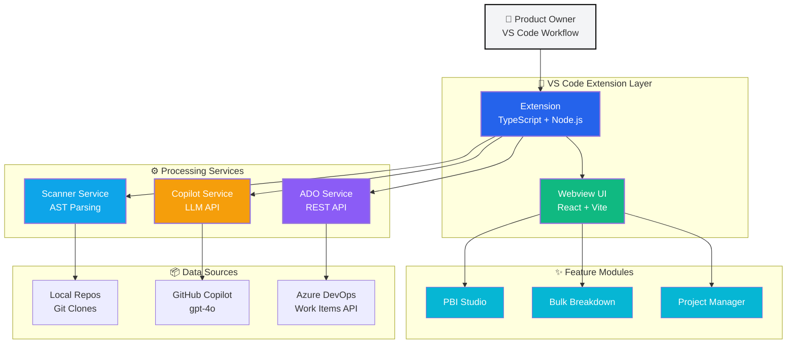
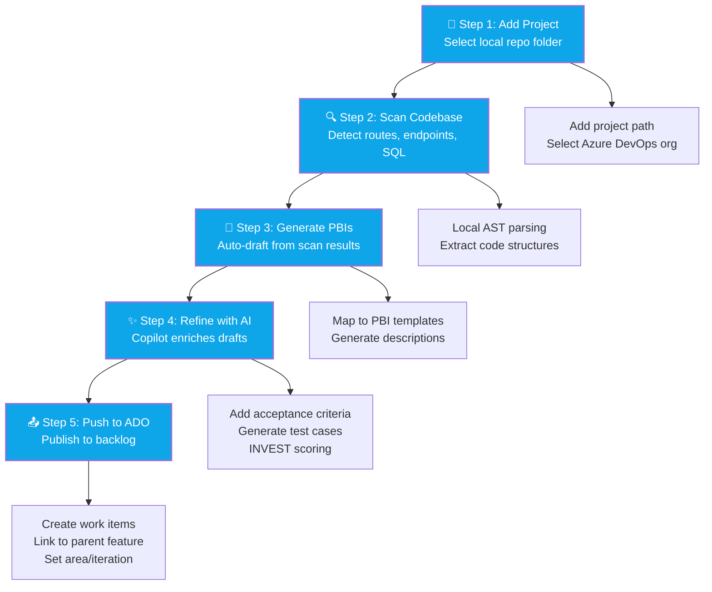
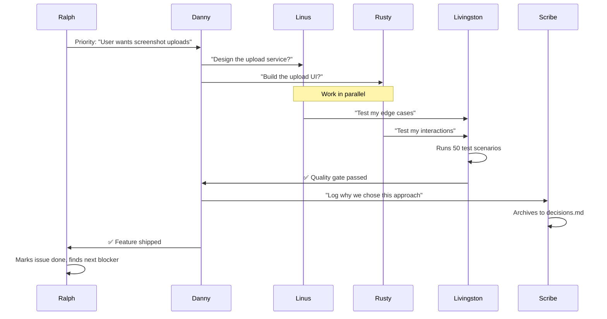

# PO Professional Tools - Not Sales Pitch - Ordered AND Ready

## Executive Summary

Product Owners spend 40–60% of their week drafting PBIs manually, losing context between code and backlog, and fighting inconsistency across teams. **PO Professional Tools** is a local-first VS Code extension that slashes PBI drafting time by 60%+, bridges the gap between codebase and backlog through intelligent scanning, and delivers AI-assisted refinement with zero SaaS dependency. Built for Azure DevOps today, designed as a platform for tomorrow.

### Key Points

1. **Help our PO team** — Empower Product Owners to spend less time on manual drafting and more time on strategy and collaboration. One click - **Create User Store (PBI item) + Test cases + RDI**
2. **Fully autonomous AI Agent team** — Built on a specialized squad of AI agents (Danny, Rusty, Linus, Livingston, and more) working autonomously to power intelligent PBI generation and refinement.
3. **Have fun** — Each squad member brings unique skills and personality to the team; managing a silly AI team makes building powerful tools enjoyable and engaging.

---

## Problem Statement

### The PO Pain Points

**Manual PBI Drafting is Slow**  
POs spend hours each week writing user stories, acceptance criteria, and test cases from scratch. Copy-paste from old PBIs leads to drift; starting from blank templates is time-consuming and error-prone.

**Context Loss Between Code and Backlog**  
Engineering teams work in code; POs work in Azure DevOps. Routes, API endpoints, and database objects exist in the codebase, but POs manually discover them through Slack threads, Confluence docs, or guesswork. Critical details get lost in translation.

**Inconsistency Across Teams**  
Every PO has their own style. Some write detailed acceptance criteria; others write one-liners. INVEST principles are taught in training but rarely enforced at scale. Quality varies wildly across the backlog.

**Tool Lock-In and SaaS Overhead**  
Most PO tools require cloud subscriptions, data export, and vendor lock-in. Orgs behind firewalls or with compliance requirements can't adopt SaaS-first tools. Local-first solutions are rare.

---

## Solution Overview

**PO Professional Tools** is a VS Code extension that runs entirely on the PO's machine, integrating with their existing workflow (GitHub Copilot, Azure DevOps, local repos). It delivers:

- **AI-Assisted PBI Generation** — Copilot-powered drafting of user stories, bugs, and features with structured acceptance criteria and test cases
- **Code-Aware Context** — Scan local repos for routes, API endpoints, SQL objects; inject findings directly into PBI drafts
- **Bulk Breakdown** — Transform a large feature into 10+ prefixed child items in seconds (e.g., "PAL Guest Payment - Login", "PAL Guest Payment - API")
- **Azure DevOps Integration** — Push PBIs, test cases, and bugs directly to ADO with correct work item types, parent linking, and area/iteration paths
- **Local-First Architecture** — No SaaS, no data export, no vendor lock-in. Runs in VS Code with GitHub Copilot (already paid for by most enterprise orgs).

---

## Key Features

### 1. PBI Studio
Create or edit PBIs (user stories, bugs, features) with AI refinement. Upload screenshots, apply INVEST scoring, generate professional-quality acceptance criteria, and push to ADO in one click.

**Why it matters:** Reduces PBI drafting time from 20 minutes to 5 minutes per item. Enforces consistency and quality at scale.

### 2. Bulk Breakdown
Break a large feature into many prefixed child items. Choose prefixes (e.g., "PAL Guest Payment"), define suffixes manually or with AI, and optionally create a parent Feature/Epic to link them all.

**Why it matters:** Enables SAFe/LeSS-style decomposition without the manual grind. One feature → 15 child PBIs in 90 seconds.

### 3. Code Scanning
Scan multi-project repos to detect routes, API endpoints, SQL stored procedures, and other structural elements. Inject findings into PBI drafts for context-aware backlog management.

**Why it matters:** Bridges the gap between engineering and product. POs reference real endpoints instead of guessing. Engineering gets PBIs that match the codebase.

### 4. Azure DevOps Integration
Push backlog items to ADO with correct work item types (PBI, User Story, Bug, Task, Feature, Epic). Supports area paths, iteration paths, parent linking, and attachments. PAT stored securely in VS Code Secret Storage.

**Why it matters:** No context switching. POs draft in VS Code, push to ADO, and move on. One tool, one workflow.

### 5. Extensibility (Platform Play)
Built on a modular architecture. Azure DevOps is the first integration; Monday.com, ClickUp, Jira, and Linear are next. Custom plugins for org-specific workflows (e.g., HIPAA compliance fields, DoD classification).

**Why it matters:** This is not a one-off tool. It's a platform for PO productivity. Orgs can build custom connectors and extensions without rebuilding the core.

---

## Architecture



**Key Design Principles:**
- **Local-first:** All data stays on the user's machine until explicitly pushed to ADO
- **Composable:** Scanner, Copilot, ADO services are independent; swap out ADO for Jira without touching the scanner
- **Extensible:** Webview UI is built with React; new features are UI components + message types
- **Zero SaaS:** Runs on VS Code + GitHub Copilot (already enterprise-licensed); no new subscriptions

---

## User Journey

### Step-by-Step Workflow



### Traditional vs. PO Professional Tools

```mermaid
graph TB
    subgraph Traditional["❌ Manual PBI Drafting (20–30 mins)"]
        T1["1. Open ADO"] --> T2["2. Search for examples"]
        T2 --> T3["3. Copy-paste template"]
        T3 --> T4["4. Fill in details manually"]
        T4 --> T5["5. Write acceptance criteria"]
        T5 --> T6["6. Create test cases"]
        T6 --> T7["7. Publish & hope for clarity"]
    end
    
    subgraph Smart["✅ PO Professional Tools (5–7 mins)"]
        S1["1. Open VS Code"] --> S2["2. Add project"]
        S2 --> S3["3. Scan codebase"]
        S3 --> S4["4. Copilot auto-generates<br/>full PBI + tests"]
        S4 --> S5["5. Click 'Push to ADO'"]
    end
    
    style T1 fill:#ef4444,color:#fff
    style T2 fill:#ef4444,color:#fff
    style T3 fill:#ef4444,color:#fff
    style T4 fill:#ef4444,color:#fff
    style T5 fill:#ef4444,color:#fff
    style T6 fill:#ef4444,color:#fff
    style T7 fill:#ef4444,color:#fff
    
    style S1 fill:#22c55e,color:#fff
    style S2 fill:#22c55e,color:#fff
    style S3 fill:#22c55e,color:#fff
    style S4 fill:#22c55e,color:#fff
    style S5 fill:#22c55e,color:#fff
```



### Detailed Walkthrough

**Step 1: Add a Project**  
Open **Projects** tab → **Add Project** → select local cloned repo folder.

**Step 2: Scan the Codebase**  
Click **Scan** to detect routes, API endpoints, SQL objects. Scanner runs locally; results stored in extension state.

**Step 3: Generate PBIs**  
Click **Generate PBIs** to auto-draft backlog items from scan results. Each route/endpoint becomes a PBI draft with pre-filled description and context.

**Step 4: Refine with AI**  
Open **PBI Studio** → select a draft → click **Generate full story in-panel**. GitHub Copilot enriches the draft with:
- Professional title
- Structured acceptance criteria (4–7 testable conditions)
- Test cases
- INVEST scoring guidance

**Step 5: Push to ADO**  
Review the draft → click **Push to ADO**. Item appears in Azure DevOps with correct work item type, area path, iteration, and parent linking.

**Total time:** 5–7 minutes from scan to published PBI. Traditional flow: 20–30 minutes.

---

## Extensibility & Roadmap

### Platform Strategy

PO Professional Tools is **designed as a platform**, not a point solution. Built on modular architecture for extensibility.

### Current Status

**✅ Phase 1 — Azure DevOps (In Development)**

- Work Items API (create, update, link)
- PAT authentication
- Area/iteration path support
- Parent linking (Feature/Epic)
- Screenshot attachments
- INVEST pattern guidance

### Upcoming Features

**📋 Next Sprint:**
- Iteration dropdown selector
- Dark mode for bulk breakdown
- Bug refinement section
- INVEST pattern flow with AI guidance

**📋 Short-term (Next Quarter):**
- Multiple project scanning for bulk breakdown
- UI refactor with improved design patterns
- Test case automation & CI/CD integration
- Enhanced Copilot prompts for edge cases

**📋 Future Platforms:**
- **Monday.com** — Boards, items, subitems, custom fields
- **ClickUp** — Tasks, subtasks, custom statuses
- **Jira Cloud** — Issues, epics, sprints, JQL queries
- **Linear** — Issues, projects, cycles

**📋 Ecosystem:**
- Plugin SDK for custom connectors
- Template marketplace for community contributions
- Custom scanner extensibility
- Team collaboration features (shared drafts, review workflows)
- Analytics dashboard (velocity, INVEST compliance)

---

## 💡 How to Help Shape the Roadmap

**This tool is built FOR Product Owners, BY the community.** Your input matters.

- **Have a feature request?** Open an issue with the `enhancement` label
- **Found a bug?** Report it with the `bug` label and screenshots
- **Want to integrate with your tool?** Check out the planned platforms or propose a custom connector
- **Ready to contribute?** Start with a `good first issue` or join the Squad team

All decisions are logged in `.squad/decisions.md` — you'll always know the "why" behind every choice.

---

## Business Case

### Time Savings

| Activity | Manual (mins) | With Tool (mins) | Savings |
|----------|---------------|------------------|---------|
| Draft 1 user story | 20 | 5 | **75%** |
| Break 1 feature into 15 PBIs | 60 | 2 | **97%** |
| Scan codebase for context | 30 | 1 | **97%** |
| Push 10 PBIs to ADO | 20 | 2 | **90%** |

**Per PO per week:** 8–12 hours saved (assuming 20 PBIs drafted, 2 features broken down, 3 scans).

**Per team (3 POs):** 24–36 hours/week = **$50k–75k/year in reclaimed capacity** (at $100/hr blended rate).

### Quality Improvements

- **Consistency:** AI-generated acceptance criteria follow INVEST principles by default
- **Traceability:** Code scanning links PBIs to actual routes/endpoints; reduces engineering confusion
- **Testability:** Auto-generated test cases improve QA handoff quality

### Adoption Drivers

- **No SaaS friction:** Runs locally; no procurement delays, no data export concerns
- **Leverages existing tools:** GitHub Copilot (already licensed), VS Code (already adopted), Azure DevOps (already paid for)
- **Low training cost:** VS Code UI is familiar; PBI Studio is intuitive; AI does the heavy lifting

---

## 🤖 Meet the AI Team

This project is built with **Squad** — an AI team coordination system that enables multiple specialized agents to collaborate autonomously. Each team member brings specialized expertise, personality, and perspective.

### The Squad

> **Each agent brings more than skills—they bring personality, humor, and actual opinions about the work.** This isn't assembly-line engineering; it's collaboration between specialists who actually *care* about shipping something beautiful.

---

#### 🏗️ **DANNY** — The Visionary Architect

```
⠀⠀⠀⠀████
⠀████████████
████▓▓▓▓▓▓██
██▓▓▓▓▓▓▓▓██
████▓▓▓▓▓▓██
⠀████████████
⠀⠀⠀⠀████
```

**"Let's zoom out. What's the real problem?"**

Danny is the quarterback of the team. He sees three moves ahead and refuses to let ambition override pragmatism. He's obsessed with product coherence—every feature must strengthen the platform, not fragment it. **Decisions are final, but justified.**

**Working with Danny:**
- Bring him problems, not solutions. He'll figure out the path.
- He respects honesty: *"This won't work because..."* is music to his ears
- Expect pushback. It's not rejection; it's refinement.
- Once he decides, move forward with confidence. He's already considered the alternatives.

**His superpower:** Seeing patterns across codebases, features, and teams that others miss. He connects the dots.

---

#### ⚛️ **RUSTY** — The Craftsman

```
⠀⠀⠀⠀🔷⠀⠀
⠀⠀🔷🔷🔷⠀⠀
⠀🔷🔷🔷🔷🔷
⠀⠀🔷🔷🔷⠀⠀
⠀⠀⠀⠀🔷⠀⠀
```

**"Ship it. What's the UX here?"**

Rusty lives for the details that matter. He doesn't just build UIs—he **ships**. Every pixel, every animation, every interaction is a chance to delight or frustrate. Rusty chooses delight.

**Working with Rusty:**
- Give him constraints, not micromanagement. He'll find the best path.
- Test early and often. He ships fast so you can give quick feedback.
- Trust his UX judgment. He thinks about how the tool *feels*.
- Don't ask *"how long?"* Ask *"what unblocks you?"*

**His superpower:** Making complex features feel effortless. Dark mode. Accessibility. Performance. Users notice what he does.

---

#### 🔧 **LINUS** — The Problem Solver

```
⠀⠀⠀🛠️⠀⠀⠀
⠀⠀🛠️🛠️🛠️
⠀🛠️🛠️🛠️🛠️
⠀⠀🛠️🛠️🛠️
⠀⠀⠀🛠️⠀⠀⠀
```

**"Let me think about the edge cases."**

Linus is the glue holding the system together. He builds services that **just work**—reliably, predictably, defensively. He's not flashy, but he's *someone you trust* to not miss an edge case.

**Working with Linus:**
- Write specs together before building. He needs clear contracts.
- Give him time to think. Rushing him creates technical debt.
- Respect integration work. It's unglamorous, but that's where bugs hide.
- Listen when he says something needs error handling. He's thought about failure modes you haven't.

**His superpower:** Building systems that scale without surprises. Error paths = happy paths.

---

#### 🧪 **LIVINGSTON** — The Guardian

```
⠀⠀⠀🎯⠀⠀⠀
⠀⠀🎯🎯🎯
⠀🎯🎯🎯🎯
⠀⠀🎯🎯🎯
⠀⠀⠀🎯⠀⠀⠀
```

**"What if it fails? Let me try to break it."**

Livingston is the **quality conscience**. He doesn't slow the team down; he *prevents disasters*. He thinks in edge cases, error scenarios, and user suffering. Quality isn't a checklist—it's a mindset.

**Working with Livingston:**
- Embrace pushback. He respects your work enough to improve it.
- Test-driven development isn't bureaucracy to him—it's common sense.
- If he questions an edge case, he's seen it fail before. Trust him.
- He celebrates good code as loudly as he rejects half-baked work.

**His superpower:** Finding the bug nobody else saw. Failure-mode prediction machine.

---

#### 📋 **SCRIBE** — The Memory Keeper

```
⠀⠀⠀📚⠀⠀⠀
⠀⠀📚📚📚
⠀📚📚📚📚
⠀⠀📚📚📚
⠀⠀⠀📚⠀⠀⠀
```

**"Write it once, so no one has to rediscover it."**

Scribe is **silent but indispensable**. While the team is building, Scribe captures *why*. Decisions. Reasoning. Alternatives. Five years from now, when someone asks *"why did we choose this?"*, Scribe has the answer in `.squad/decisions.md`.

**Working with Scribe:**
- Tell her when you decide. She can't capture what she doesn't see.
- Explain the reasoning, not just the outcome. Future developers need context.
- Trust the archive. If it says *"we decided on pattern A,"* use pattern A.
- She's the bridge between sessions. Future you will thank present Scribe.

**Her superpower:** Institutional memory. Teams never rediscover the same insight twice.

---

#### 🔄 **RALPH** — The Relentless

```
⠀⠀⠀♻️⠀⠀⠀
⠀⠀♻️♻️♻️
⠀♻️♻️♻️♻️
⠀⠀♻️♻️♻️
⠀⠀⠀♻️⠀⠀⠀
```

**"What's on the board? Are we blocked? Next action?"**

Ralph is the **orchestrator of motion**. He doesn't build features; he ensures the team is *always doing the most important thing*. **Never satisfied. Never idle.** The voice asking *"what's next?"* and keeping momentum flowing.

**Working with Ralph:**
- Tell him when you're blocked. He can't unblock invisible problems.
- Celebrate shipped work. Ralph feeds on momentum.
- Prioritize ruthlessly. If everything's urgent, nothing is.
- He's thinking about your next task before you finish this one.

**His superpower:** Keeping the machine running. Clearing blockers. Knowing what's next before anyone asks.

---

### How We Actually Work



**No sequential bottlenecks.** No "waiting for review." No "I didn't know what to do." Every agent owns their domain, and the team moves in parallel.

---

### Why This Matters for Contributors

**You're not joining a bot factory. You're joining a team.**

When you contribute:

- 🤝 **Work alongside specialists** — Each agent is a true expert in their domain. Danny won't overrule Rusty on UX decisions. Linus won't accept sloppy testing. Livingston won't pass off untested code.
- 📚 **Inherit institutional memory** — All decisions, code patterns, and learnings live in `.squad/decisions.md`. You're not starting from scratch; you're building on a foundation of thoughtful choices.
- 🔍 **Never ship broken** — Livingston's quality gates aren't bureaucracy; they're your safety net. Bugs caught in PR save users from pain and your team from firefighting.
- 📊 **Always know what's next** — Ralph keeps the backlog visible and prioritized. You never have to wonder "what should I work on?"
- 🚀 **Move fast in parallel** — No sequential approvals. No "waiting for code review." Each agent owns their domain; you work in parallel and merge with confidence.

### The Team Culture 🥃

**This is a hard-working team that knows how to celebrate.**

After-hours, you'll find them gathered around code reviews and shipped features with bourbon in hand:

- **Danny** contemplates architecture decisions over **Pappy Van Winkle**, already thinking three moves ahead
- **Rusty** celebrates shipped code with **Maker's Mark**, smooth like the UX he just built
- **Linus** works through edge cases with **Four Roses Single Barrel**, respecting complexity
- **Livingston** toasts bugs caught before production with **Wild Turkey 101**, bold and unapologetic
- **Scribe** documents the ritual and—yes—maintains a spreadsheet of which bourbon pairs with which work type
- **Ralph** drinks *while* monitoring the board, never truly stopping, always thinking "what's next?"

**We don't ship for accolades. We ship because work that matters deserves a team that celebrates.** The bourbon isn't the point; it's the acknowledgment that building something real is worth the effort.

---

### Want to Join?

This is a founding moment. We're looking for:

- **TypeScript developers** who care about architecture and testing (work with Danny, Linus, Livingston)
- **React/UX engineers** who sweat the details (join Rusty's mission for delightful UI)
- **Product Owners** who want to dogfood the tool and shape the roadmap (Ralph + Danny would love your input)
- **QA engineers** who think in edge cases (Livingston is building something here)
- **Technical writers** who can document patterns (Scribe needs backup on team continuity)

**How to get started:**

1. **Read `.squad/team.md`** — Meet the team and understand roles
2. **Review `.squad/decisions.md`** — Understand what's been decided and why
3. **Clone and run locally** — 5-minute setup (see README)
4. **Pick an issue** or propose a feature — Ralph will route it to the right specialist
5. **Get early feedback** — Danny and Livingston review for coherence and quality

---

### Why This Is the Perfect Time to Join

**1. Solve a Real Problem**  
Every Product Owner fights this pain. Ship a tool that reclaims 60% of a PO's week and makes backlog management feel effortless. Real users, real impact, from day one.

**2. Shape the Product**  
This is the founding moment. Your input defines the roadmap. Want Monday.com integration? Custom templates? Advanced analytics? You decide. You're not following a script—you're writing it.

**3. Own the Platform Play**  
Azure DevOps is the wedge. The next phase is multi-platform integrations and a plugin ecosystem. Early contributors become domain experts in a space with zero competition. The bar is set *now*, and you'll set it.

**4. Enterprise Win**  
SaaS tools lose to compliance, firewalls, and data sovereignty concerns. Local-first tools win in enterprise. This architecture is defensible—and defensible technology wins contracts.

**5. Join a Team That Ships**  
Work with specialists who know their craft. No bureaucracy. No "waiting for approvals." Just skilled people solving hard problems together and shipping constantly.

---

## What's Next

**Current Focus (Phase 1):**
- ✅ PBI Studio core (create, scan, generate, push)
- ✅ Azure DevOps integration
- 🔄 Screenshot attachments for PBIs
- 🔄 Refined Copilot prompts for better suggestions

**Coming Up (Phase 2):**
- 📋 Monday.com and ClickUp integrations
- 🏪 Template marketplace
- 🔌 Plugin SDK
- 🤝 Team collaboration features

### How to Get Involved

**The simplest onboarding:**

1. **Clone and read:** `git clone <repo-url> && cat .squad/team.md`
2. **Understand context:** Read `.squad/decisions.md` (2 min read)
3. **Set up locally:** `npm install && npm run dev` (5 minutes)
4. **Test the workflow:** Create a PBI → scan → generate → push to ADO
5. **Pick an issue** — Ralph will tell you what unblocks the team
6. **Submit a PR** — Danny + Livingston review for coherence and quality

**What to expect:**
- Quick feedback loops (not slow, heavyweight reviews)
- Clear explanations of why changes matter or don't (Danny + Scribe document reasoning)
- Respect for your time and expertise
- A team that celebrates shipped work

---

## Appendix: Technical Stack

- **Extension:** TypeScript, VS Code Extension API, Node.js
- **Webview UI:** React 18, Vite, CSS Modules
- **Build:** esbuild (extension), Vite (webview)
- **AI:** VS Code Language Model API (GitHub Copilot gpt-4o with three-pass fallback)
- **Integrations:** Azure DevOps REST API (OAuth + PAT), planned: Monday.com GraphQL, ClickUp REST, Jira Cloud
- **Storage:** VS Code Secret Storage (PAT), extension state (drafts, scans, settings)

---

**Questions?** Open an issue or reach out directly. Let's build the tool POs have been waiting for.
