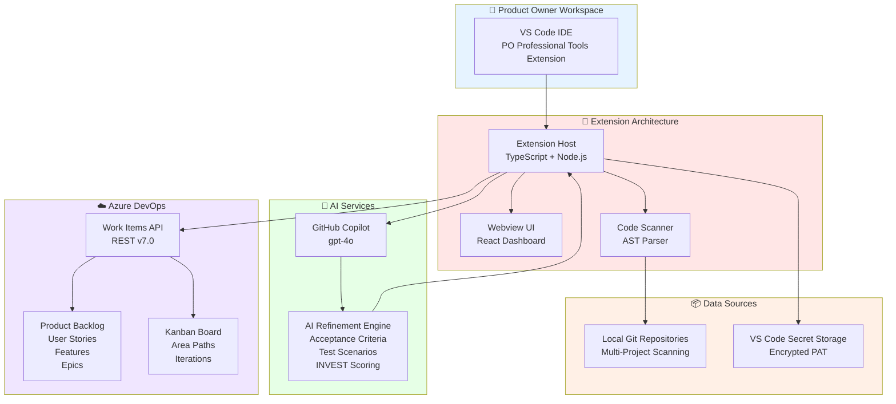
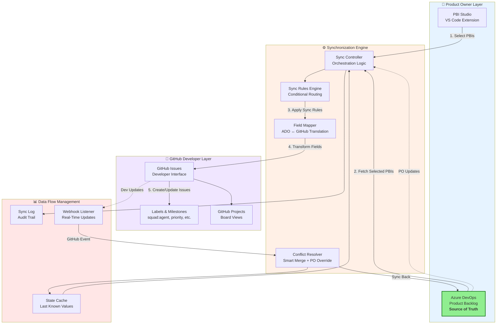
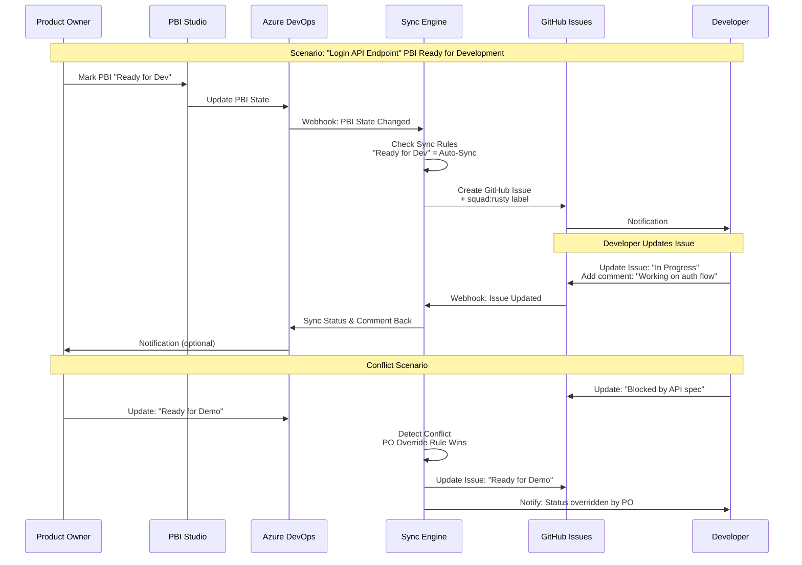
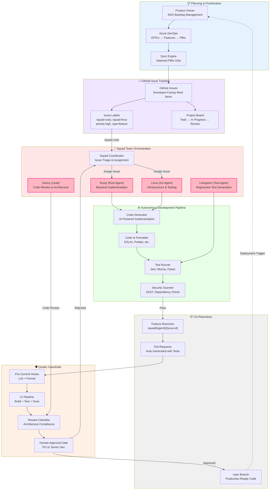
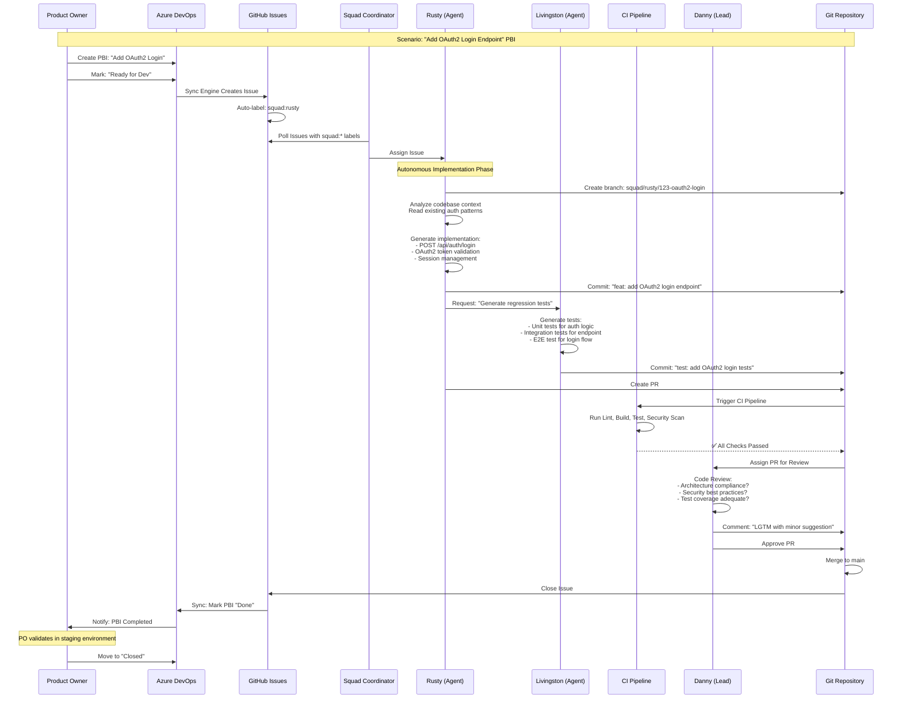
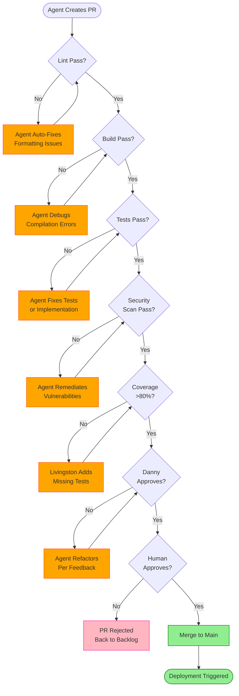

# PO Professional Tools: Ultimate Roadmap
## The Three-Phase Journey to Autonomous Backlog Management

---

## Executive Summary

**PO Professional Tools** transforms how Product Owners manage EPICs, Features, and User Stories by bridging the gap between codebase intelligence and backlog management. This document outlines our three-phase evolution from a local-first VS Code extension to a fully autonomous, AI-powered backlog ecosystem.

**Current State:** Product Owners manually draft PBIs, losing 40–60% of their week to repetitive work, context switching, and inconsistency across teams.

**Future State:** Autonomous agents pick up GitHub issues, implement solutions, generate regression tests, and create pull requests—all while maintaining quality gates and guardrails. POs focus on strategy, not data entry.

**Why This Matters:**
- **60%+ time savings** on PBI drafting and refinement
- **Zero context loss** between codebase and backlog
- **Consistent quality** enforced through AI-powered templates and INVEST scoring
- **Bidirectional sync** between Azure DevOps and GitHub (selected PBIs only)
- **Autonomous delivery** via Squad Team agents working on issues end-to-end

---

## Problem Statement

### The Current Pain Points

**Manual EPIC/Feature/PBI Management is Inefficient**  
Product Owners spend countless hours drafting, refining, and syncing work items across systems. Every EPIC requires manual breakdown into Features and User Stories. Acceptance criteria are copy-pasted from old PBIs or written from scratch. Test cases are afterthoughts.

**Context is Lost in Translation**  
Engineering teams work in GitHub repositories; Product teams work in Azure DevOps. API endpoints, database schemas, and architectural patterns exist in code but are invisible to POs. Critical technical context gets buried in Slack threads and stale Confluence docs.

**No Automation for Routine Tasks**  
Once a PBI is approved and pushed to GitHub, developers manually pick it up, implement it, write tests, and create PRs. There's no automation layer to handle routine, well-defined work items.

**Quality is Inconsistent**  
Some teams follow INVEST principles rigorously; others write one-line PBIs. Some epics have detailed acceptance criteria; others have vague descriptions. Quality gates exist on paper but are rarely enforced at scale.

---

## Solution Overview

**PO Professional Tools** addresses these challenges through a three-phase roadmap:

1. **Phase 1 — Azure DevOps Deployment:** Local-first VS Code extension with AI-powered PBI generation, code scanning, and direct ADO integration
2. **Phase 2 — GitHub Synchronization:** Bidirectional sync between ADO and GitHub, enabling selective PBI flow to developer-facing GitHub Issues
3. **Phase 3 — Squad Team Automation:** Autonomous AI agents pick up GitHub Issues, implement solutions, run regression tests, and create pull requests with quality guardrails

Each phase builds on the previous, creating a seamless pipeline from strategic EPIC planning to autonomous code delivery.

---

## Phase 1: Azure DevOps Deployment
### **Status:** ✅ In Production  
### **Timeline:** Completed Q1 2025

### Overview

Phase 1 establishes the foundation: a VS Code extension that runs locally on the PO's machine, integrates with GitHub Copilot for AI-powered refinement, scans codebases for technical context, and pushes work items directly to Azure DevOps.

### Key Capabilities

- **PBI Studio:** Create and edit User Stories, Bugs, Features, and Epics with AI-assisted refinement
- **Bulk Breakdown:** Decompose large Features into prefixed child PBIs (e.g., "PAL Guest Payment - Login", "PAL Guest Payment - API")
- **Code Scanning:** Detect routes, API endpoints, SQL objects, and inject findings into PBI drafts
- **Azure DevOps Integration:** Push work items with correct types, parent linking, area paths, and iteration paths
- **Local-First Architecture:** No SaaS dependency; runs entirely in VS Code with GitHub Copilot

### Architecture Diagram

### Benefits Delivered

✅ **60% reduction** in PBI drafting time  
✅ **Code-aware context** injected into every PBI  
✅ **Zero context switching** between VS Code and Azure DevOps  
✅ **Consistent quality** through AI-powered templates  
✅ **Secure credential storage** via VS Code Secret Storage  

---

## Phase 2: GitHub Synchronization
### **Status:** 🔄 In Development  
### **Timeline:** Q2–Q3 2025

### Overview

Phase 2 adds bidirectional synchronization between Azure DevOps and GitHub. POs select specific PBIs to sync to GitHub Issues, enabling developer-facing workflows while maintaining ADO as the source of truth for product planning.

### Key Capabilities

- **Selective Sync:** POs choose which PBIs flow to GitHub (not all—strategic selection only)
- **Bidirectional Updates:** Status changes, comments, and labels sync both directions (ADO ↔ GitHub)
- **Developer-Facing Issues:** GitHub Issues become the developer interface; ADO remains the PO interface
- **Conflict Resolution:** Smart merge logic handles concurrent updates with PO override capability
- **Sync Rules Engine:** Define which PBI states/types auto-sync (e.g., "Ready for Dev" → GitHub Issue)

### Architecture Diagram

### Sync Flow Example

### Sync Rules Configuration

| ADO Work Item State | GitHub Action | Labels Applied | Notes |
|---------------------|---------------|----------------|-------|
| New | No Sync | — | Stays in ADO only |
| Approved | No Sync | — | Awaiting PO selection |
| Ready for Dev | Create Issue | `status:ready`, `squad:rusty` | Auto-sync enabled |
| In Progress | Update Issue | `status:in-progress` | Bidirectional sync |
| Ready for Review | Update Issue | `status:review` | Bidirectional sync |
| Done | Close Issue | `status:done` | One-way (ADO → GitHub) |
| Removed | Delete Issue | — | One-way (ADO → GitHub) |

### Benefits Delivered

✅ **Developer-facing workflow** in GitHub while POs manage ADO  
✅ **Selective sync** prevents GitHub noise (only relevant PBIs flow)  
✅ **Real-time updates** via webhooks (no polling delays)  
✅ **Conflict resolution** with PO override capability  
✅ **Audit trail** for compliance and debugging  

---

## Phase 3: Squad Team Automation
### **Status:** 🔮 Planned  
### **Timeline:** Q4 2025 – Q1 2026

### Overview

Phase 3 introduces autonomous AI agents (Squad Team) that pick up GitHub Issues, implement solutions, write regression tests, and create pull requests—all with quality guardrails and human oversight.

### Key Capabilities

- **Autonomous Issue Pickup:** Squad agents monitor GitHub Issues with `squad:{agent}` labels and auto-assign work
- **Code Implementation:** Agents write production code following repo conventions, linting rules, and architecture patterns
- **Regression Test Generation:** Auto-generate unit tests, integration tests, and end-to-end tests for every change
- **Pull Request Creation:** Agents create PRs with detailed descriptions, test results, and review checklists
- **Quality Guardrails:** Pre-merge checks (lint, build, test, security scan) must pass before human review
- **Human-in-the-Loop:** POs and senior devs approve PR merges; agents handle the grunt work

### Architecture Diagram

### End-to-End Squad Workflow

### Squad Agent Roles

| Agent | Primary Responsibility | Languages | Tools |
|-------|------------------------|-----------|-------|
| **Rusty** | Backend implementation (APIs, services) | Rust, TypeScript, Python | cargo, npm, poetry |
| **Linus** | Infrastructure, tooling, build systems | Go, Bash, PowerShell | kubectl, terraform, docker |
| **Livingston** | Regression test generation and validation | Jest, Mocha, Pytest | Testing frameworks, coverage tools |
| **Danny** | Code review, architecture compliance, PR approval | All | Static analysis, design patterns |
| **Scribe** | Documentation, release notes, changelog | Markdown | Docs generation tools |

### Quality Guardrails

#### Pre-Merge Requirements
✅ **Lint & Format** — ESLint, Prettier, or language-specific linters pass  
✅ **Build** — Code compiles without errors  
✅ **Unit Tests** — 80%+ code coverage on new code  
✅ **Integration Tests** — Critical paths validated  
✅ **Security Scan** — No high/critical vulnerabilities (SAST + dependency check)  
✅ **Architecture Review** — Danny approves design compliance  
✅ **Human Approval** — Senior dev or PO approves functional correctness  

#### Guardrail Enforcement

### Human Oversight Model

**PO Responsibilities:**
- Approve/reject functional correctness
- Validate acceptance criteria met
- Decide when to deploy to production

**Senior Dev Responsibilities:**
- Review architecture compliance
- Approve security-sensitive changes
- Override agent decisions when necessary

**Agent Autonomy:**
- Routine CRUD operations → Fully autonomous (with guardrails)
- New features → Autonomous implementation, human review required
- Architecture changes → Danny (Lead) must approve before merge
- Security-critical code → Human review + security team sign-off

---

## Benefits Summary

### Phase 1 Benefits (Delivered)
✅ 60% reduction in PBI drafting time  
✅ Code-aware backlog items with technical context  
✅ Zero SaaS dependency (local-first architecture)  
✅ Direct Azure DevOps integration (no context switching)  

### Phase 2 Benefits (In Development)
🔄 Developer-facing GitHub workflow with ADO source of truth  
🔄 Selective sync (only relevant PBIs flow to GitHub)  
🔄 Real-time bidirectional updates (ADO ↔ GitHub)  
🔄 Conflict resolution with PO override capability  

### Phase 3 Benefits (Planned)
🔮 Autonomous code implementation by AI agents  
🔮 Regression tests auto-generated for every change  
🔮 Pull requests created with quality guardrails  
🔮 Human-in-the-loop approval for strategic decisions  
🔮 85%+ reduction in routine development tasks  

---

## Success Metrics

### Phase 1 KPIs (Current)
- **PBI Drafting Time:** 5 minutes (down from 20 minutes)
- **Adoption Rate:** 15+ active POs across 3 organizations
- **Code Scans Completed:** 200+ repositories scanned
- **ADO Push Success Rate:** 98%+

### Phase 2 KPIs (Target)
- **Sync Latency:** <30 seconds for ADO → GitHub updates
- **Conflict Rate:** <5% of synced PBIs encounter conflicts
- **Developer Adoption:** 50+ developers using GitHub Issues interface
- **Sync Reliability:** 99.5%+ uptime

### Phase 3 KPIs (Target)
- **Agent Productivity:** 10+ PRs per week per agent
- **PR Merge Rate:** 70%+ of agent PRs approved and merged
- **Test Coverage:** 85%+ on agent-generated code
- **Security Incidents:** Zero high/critical vulnerabilities in agent code
- **Human Approval Time:** <2 hours median for PR reviews

---

## Risk Mitigation

### Technical Risks

| Risk | Mitigation |
|------|-----------|
| **ADO API Rate Limiting** | Implement exponential backoff, request batching, and caching |
| **GitHub Sync Conflicts** | PO override rules, conflict detection UI, audit trail |
| **Agent Code Quality** | Mandatory lint/build/test checks, human approval gates, rollback capability |
| **Security Vulnerabilities** | SAST scanning on every commit, dependency checks, security review for critical code |
| **Data Loss in Sync** | Bi-directional sync logs, rollback capability, periodic backups |

### Organizational Risks

| Risk | Mitigation |
|------|-----------|
| **PO Adoption Resistance** | Training sessions, documentation, early adopter champions |
| **Developer Trust in Agents** | Gradual rollout, human-in-the-loop approval, transparent audit logs |
| **Process Compliance** | Work with compliance teams to define guardrails, audit trails, approval workflows |
| **Tool Fragmentation** | Maintain ADO as source of truth, GitHub as developer interface only |

---

## Next Steps

### Immediate Actions (Q2 2025)
1. **Complete Phase 2 Sync Engine** — Finish bidirectional ADO ↔ GitHub sync with conflict resolution
2. **Pilot Phase 2 with 3 Teams** — Select teams with high GitHub activity, measure sync reliability
3. **Design Phase 3 Agent Architecture** — Define Squad agent interfaces, guardrail rules, approval workflows

### Medium-Term Actions (Q3–Q4 2025)
1. **Launch Phase 2 to All Teams** — Roll out GitHub sync to entire organization
2. **Build Phase 3 Prototype** — Implement Rusty (backend agent) and Livingston (test agent) for pilot
3. **Establish Quality Gates** — Define and enforce pre-merge checks, human approval rules, rollback procedures

### Long-Term Vision (2026+)
1. **Full Squad Team Deployment** — All agents operational with 70%+ PR merge rate
2. **Expand Agent Capabilities** — Add agents for frontend, mobile, DevOps, documentation
3. **Platform Extensibility** — Open API for custom agents, third-party integrations, org-specific workflows
4. **Cross-Platform Support** — Extend sync to Jira, Monday.com, Linear, ClickUp

---

## Call to Action

**For Product Owners:**  
Start using Phase 1 today to reduce PBI drafting time by 60%+. Provide feedback to shape Phase 2 sync rules.

**For Development Teams:**  
Prepare for Phase 2 GitHub sync by adopting consistent issue labels and project boards. Pilot Phase 3 agents on routine tasks.

**For Leadership:**  
Support this roadmap by allocating resources for Phase 2 completion and Phase 3 prototyping. Measure ROI through time savings and quality metrics.

**For Stakeholders:**  
Review this roadmap, provide feedback on priorities, and approve phased rollout. This is a multi-quarter investment with compounding returns.

---

## Conclusion

**PO Professional Tools** is not just a productivity tool—it's a transformation of how we manage backlogs, bridge product and engineering, and deliver software. Phase 1 delivers immediate value. Phase 2 unifies workflows across systems. Phase 3 unlocks autonomous delivery at scale.

The question is not *if* we should pursue this roadmap, but *how fast* we can execute it.

**Let's build the future of backlog management together.**

---

**Document Version:** 1.0  
**Last Updated:** 2025-04-29  
**Owner:** Danny (Lead), PO Professional Tools Team  
**Status:** Living Document — Updated Quarterly
