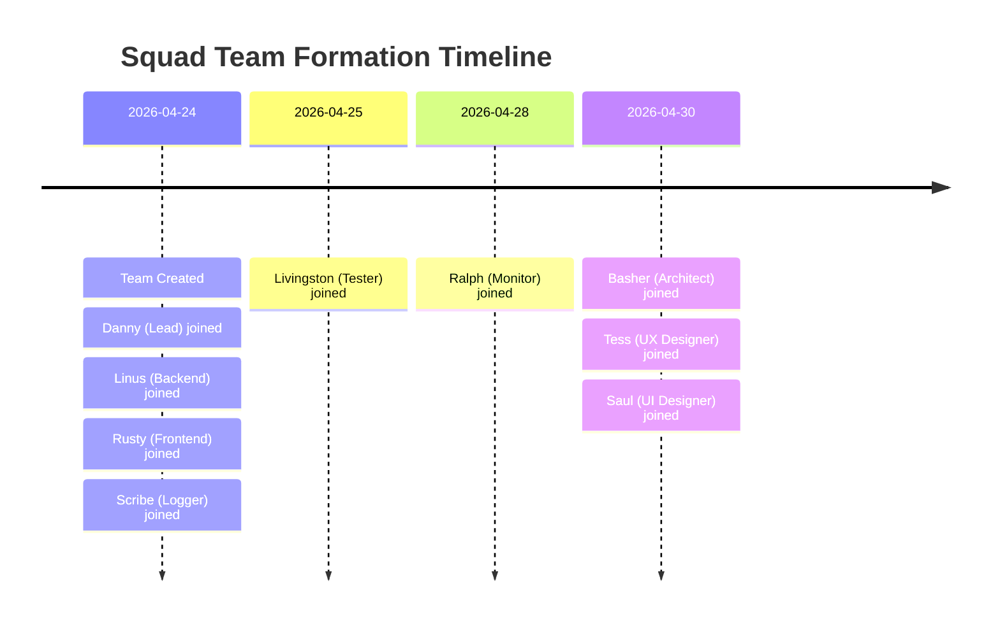
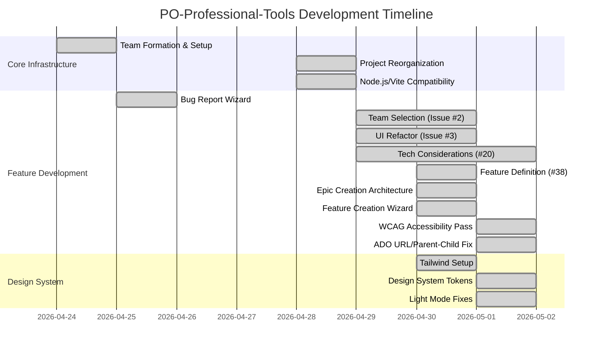
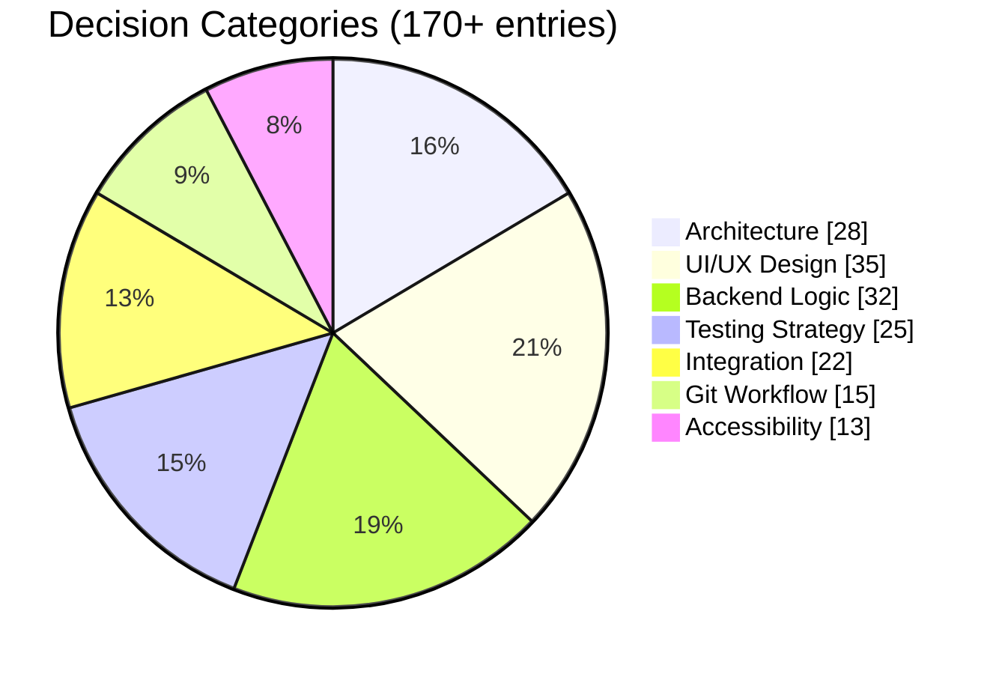
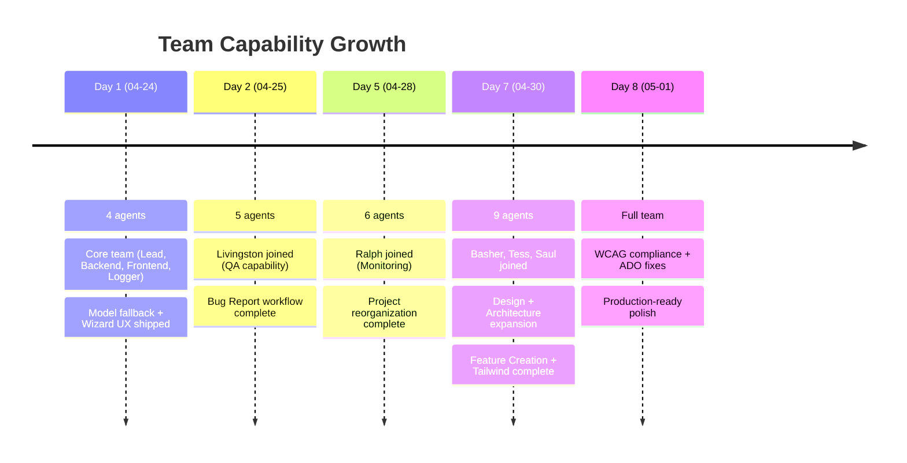
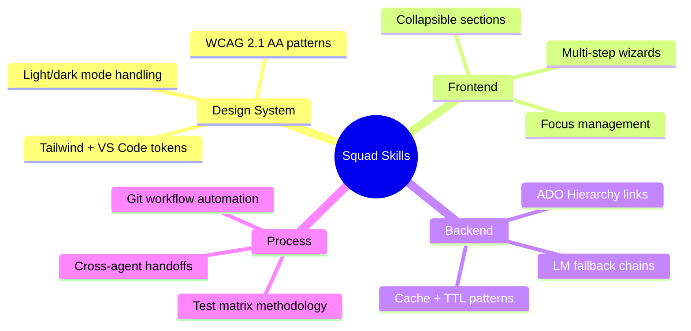
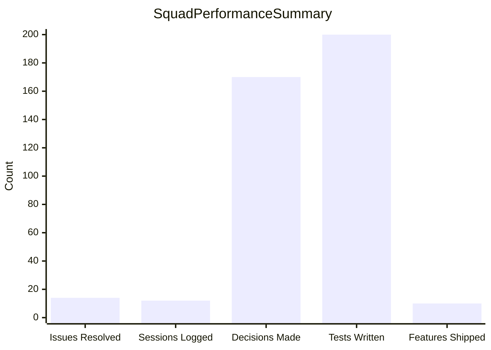
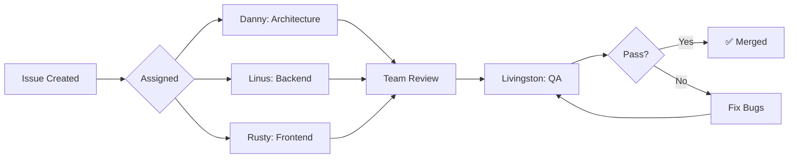

# 🤖 Squad AI Team — Performance Report
*PO-Professional-Tools | Generated: 2026-05-01*

## 1. Team at a Glance

### Team Timeline


### Current Roster

| Agent | Role | Specialization | Status |
|-------|------|----------------|--------|
| **Danny** | Lead | Architecture, code review, scope management | 🟢 Active |
| **Linus** | Backend Dev | TypeScript, VS Code API, ADO Service, Copilot integration | 🟢 Active |
| **Rusty** | Frontend Dev | React, Vite, accessibility, UI components | 🟢 Active |
| **Livingston** | Tester | QA, test matrices, validation | 🟢 Active |
| **Basher** | Solutions Architect | System design, architecture specs | 🟢 Active |
| **Tess** | UX Designer | User flows, wireframes, interaction design | 🟢 Active |
| **Saul** | UI Designer | Visual design, Tailwind CSS, WCAG compliance | 🟢 Active |
| **Scribe** | Session Logger | Documentation, session history | 🟢 Active |
| **Ralph** | Work Monitor | Process oversight, monitoring | 🔄 Monitor |

---

## 2. Project Journey

### Development Timeline


### Key Features Delivered

| Feature | Owner(s) | Complexity | Status |
|---------|----------|------------|--------|
| Language Model Fallback Chain | Linus | ⭐⭐⭐ | ✅ Shipped |
| Bug Report Wizard (4-step) | Rusty + Linus | ⭐⭐⭐⭐ | ✅ Shipped |
| Collapsible Sections UX | Rusty | ⭐⭐ | ✅ Shipped |
| Technical Considerations AI | Team | ⭐⭐⭐⭐⭐ | ✅ Shipped |
| Team Selection Dropdowns | Rusty + Linus | ⭐⭐⭐⭐ | ✅ Shipped |
| Epic/Feature/Story Hierarchy | Danny + Team | ⭐⭐⭐⭐⭐ | ✅ Shipped |
| Feature Creation Wizard | Rusty + Linus + Saul | ⭐⭐⭐⭐⭐ | ✅ Shipped |
| Tailwind + VS Code Bridge | Saul | ⭐⭐⭐⭐ | ✅ Shipped |
| WCAG 2.1 AA Compliance | Saul + Rusty | ⭐⭐⭐⭐ | ✅ Shipped |
| Jack Henry Brand Integration | Rusty | ⭐⭐ | ✅ Shipped |

---

## 3. Decision Intelligence

### Decision Metrics


### Notable Architectural Decisions

| Decision | Author | Impact |
|----------|--------|--------|
| Three-pass LM fallback chain | Linus | 🔥 High — Supports all org configurations |
| Separate EpicDraft/FeatureDraft types | Danny | 🔥 High — Clean hierarchy architecture |
| Backend contract wins (scopedFiles[]) | Danny | 🔥 High — Machine-readable, future-proof |
| Tailwind with VS Code bridge vars | Saul | ⚡ Medium — Enables theme consistency |
| Exponential backoff retry (1s→8s) | Linus | ⚡ Medium — Reliable AI generation |
| CSS max-height animations | Rusty | ⚡ Medium — Accessible, smooth UX |

---

## 4. Agent Activity & Contributions

### Agent Spawn Frequency
```mermaid
xychart-beta
    title Agent Work Sessions (from orchestration logs)
    x-axis ["Linus", "Rusty", "Saul", "Danny", "Tess", "Livingston", "Basher"]
    y-axis "Sessions" 0 --> 10
    bar [8, 7, 6, 4, 3, 4, 2]
```

### Per-Agent Contribution Summary

| Agent | Key Contributions |
|-------|------------------|
| **Danny** | Epic/Feature hierarchy architecture, Issue #20 coordination, code reviews, implementation roadmaps |
| **Linus** | ADO Service (parent-child links, push operations), CopilotService (model fallback, repo context), message handlers, cache patterns |
| **Rusty** | FeatureCreationWizard (5 steps), DashboardView components, WCAG ARIA semantics, StatusBadge, Brand integration |
| **Saul** | Tailwind v3 setup, VS Code token bridge, light mode WCAG fixes, design system SKILL.md, `@tailwindcss/forms` |
| **Tess** | RDI wizard UX spec, Feature Creation UX, Theme Settings spec, card alignment patterns |
| **Livingston** | 100+ test cases across 6 features, test matrices, P0 bug discovery, production sign-off |
| **Basher** | Epic Creation architecture spec (10 sections), implementation-ready documentation |
| **Scribe** | Session logging, team activity tracking |

---

## 5. Team Evolution

### Growth Timeline


### Complexity Growth

| Phase | Example Tasks | Complexity Level |
|-------|--------------|------------------|
| **Early** (Day 1-2) | Single-agent fixes, model fallback | ⭐⭐ Simple |
| **Mid** (Day 3-5) | Multi-file features, data flow, testing | ⭐⭐⭐ Moderate |
| **Recent** (Day 6-8) | Cross-team features, 5-step wizards, WCAG compliance | ⭐⭐⭐⭐⭐ Complex |

### Skills Earned



---

## 6. Performance Metrics Dashboard

### Overview Metrics


### Quality Gates

| Metric | Value | Status |
|--------|-------|--------|
| **Issues Tackled** | 14 unique issues (#2, #3, #20, #21, #26, #28, #29, #30, #32, #34, #36, #38, #41) | ✅ |
| **Sessions Logged** | 12 orchestration sessions | ✅ |
| **Decisions Recorded** | 170+ entries in decisions.md | ✅ |
| **Test Scenarios** | 200+ test cases across features | ✅ |
| **Features Shipped** | 10 major features | ✅ |
| **Build Status** | All builds passing | 🟢 |
| **WCAG Compliance** | AA level across all components | 🟢 |

### Issue Resolution Flow


---

## 7. What We've Learned

### Key Patterns Adopted

```mermaid
flowchart TB
    subgraph Messaging["Message Contract Pattern"]
        A[messages.ts] <-->|Sync| B[types.ts]
        B --> C[DashboardPanel.ts]
        C --> D[React Components]
    end
    
    subgraph Design["Design System"]
        E[VS Code Tokens] --> F[--tw-vscode-* bridge]
        F --> G[Tailwind Classes]
        G --> H[Components]
    end
    
    subgraph ADO["ADO Integration"]
        I[Parent Work Item] --> J[Hierarchy-Reverse Link]
        J --> K[Child Work Item]
    end
```



### Reusable Skills Discovered

| Skill | Description | Files |
|-------|-------------|-------|
| **Design System** | VS Code + Tailwind token bridge, WCAG patterns | `.squad/skills/design-system/SKILL.md` |
| **INVEST Data Flow** | Wizard → Draft → ADO export pipeline | `.squad/skills/invest-data-flow/SKILL.md` |
| **Collapsible Sections** | CSS max-height + aria-expanded pattern | `.squad/skills/collapsible-card-sections.md` |
| **Frontend Design** | Component patterns, accessibility standards | `.squad/skills/frontend-design/` |

### Team Coordination Patterns

1. **Backend Contract Wins** — When frontend/backend disagree on data shape, backend contract takes precedence (machine-readable > display convenience)
2. **Parallel Agent Work** — Independent agents can work simultaneously on same branch when changes don't conflict
3. **Decision Inbox → Merge** — Agent decisions staged in inbox, then merged to `decisions.md` after review
4. **Test Matrix Before Code** — Livingston writes test cases BEFORE implementation begins
5. **Build Verification** — Every agent commit verified with `npm run build` before handoff

---

## Appendix: Data Sources

- **Team roster:** `.squad/team.md`
- **Decisions:** `.squad/decisions.md` (170+ entries)
- **Agent histories:** `.squad/agents/*/history.md` (8 agents)
- **Orchestration logs:** `.squad/orchestration-log/` (12 sessions)
- **Session logs:** `.squad/log/` (6 detailed logs)
- **Skills library:** `.squad/skills/` (9 skills documented)

---

*Report compiled by Danny (Lead) — 2026-05-01*
